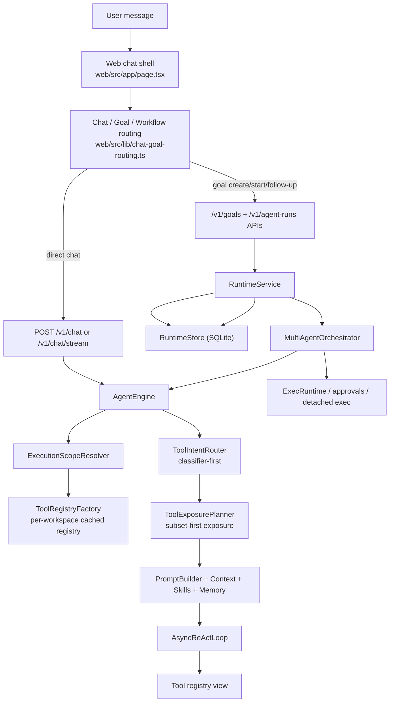

# Chat / Goal / Workflow / Runtime Current-State Architecture

Date: 2026-06-27
Status: current-state reference
Audience: future agents and maintainers working on main chat, goal routing, workflow execution, runtime supervision, or tool exposure

## 1. Product mental model

The current product model is intentionally chat-first:

- `Chat` is the primary surface.
- `Goal` is the primary user-facing long-running concept.
- `Workflow` is an execution strategy and expert override lane, not the default primary concept.
- `Agent Run` is the concrete runtime execution unit.
- `Subagent transcript` is the shared execution-visibility model for normal chat turns and Goal/AgentRun work.
- `TaskPanel` and `/goals` or `/agent-runs` pages act as operator or inspection surfaces.

The detailed transcript contract is documented in
`docs/architecture/chat-and-goal-subagent-transcript-contract.md`.

## 2. Core backend layers

## 3. Primary responsibilities by module

### 3.1 Main chat runtime

- `mochi/agents/engine.py`
  - shared execution core for chat and bounded internal classifier calls
  - owns backend routing, session context, skills, memory, tool exposure, prompt assembly, and ReAct invocation
  - `chat(...)` is the normal user turn entrypoint
  - `preview_chat_context(...)` must stay contract-aligned with real chat for tool exposure
- `mochi/api/routes/chat.py`
  - thin HTTP layer for `/v1/chat`, `/v1/chat/stream`, and `/v1/chat/context`
  - resolves project and workspace context, then delegates to `AgentEngine`
  - projects `delegate_subagent_task` calls into chat-scoped subagent transcript events

### 3.2 Tool selection and exposure

- `mochi/agents/tool_intent_router.py`
  - bounded internal intent classifier for tool exposure
  - canonical taxonomy:
    - `open_world_lookup`
    - `literature_research`
    - `workspace_read`
    - `workspace_write`
    - `execution_or_process`
    - `tool_discovery`
    - `ambiguous`
  - classifier-first, conservative fallback
  - legacy aliases still normalize:
    - `workspace_inspection -> workspace_read`
    - `workspace_mutation -> workspace_write`
- `mochi/agents/tool_exposure.py`
  - turns routed intent plus autonomy mode plus tool capabilities into a small visible tool set
  - ranking remains partly keyword-assisted, but routing is no longer supposed to live here
- `mochi/tools/registry_factory.py`
  - assembles built-in tools once per effective workspace
  - caches registries by resolved workspace path
  - prevents per-message full tool re-registration

### 3.3 Goal and workflow control plane

- `mochi/runtime/models.py`
  - API-facing models for `Goal`, `AgentRun`, approvals, guidance, and lifecycle actions
- `mochi/runtime/store.py`
  - SQLite persistence for:
    - `goals`
    - `goal_attempts`
    - `goal_leases`
    - `goal_checkpoints`
    - `goal_memory_snapshots`
    - `goal_worker_generations`
    - `goal_operator_controls`
    - `goal_operator_audit_log`
    - `agent_runs`
    - `agent_run_events`
    - `agent_run_artifacts`
    - `subagent_transcripts`
    - `subagent_transcript_events`
- `mochi/runtime/service.py`
  - durable supervisor and orchestration service
  - creates and starts goals and runs
  - resumes runs
  - manages goal health, operator controls, checkpoints, memory snapshots, detached exec visibility, and recovery
- `mochi/runtime/execution_transcript.py`
  - normalizes subagent prompt, lifecycle, guidance, and message events for both chat turns and AgentRuns
- `mochi/api/routes/goals.py`
  - thin API layer over runtime service
  - includes bounded pending-goal follow-up intent classification endpoint

### 3.4 Multi-agent execution core

- `mochi/agents/multi_agent/orchestrator.py`
  - durable execution engine for workflow-style runs
  - owns run states, role progress events, checkpoints, evidence collection, verification, and recovery payloads
  - emits normalized subagent prompt and lifecycle events with stable subagent ids
- `mochi/agents/multi_agent/protocols.py`
  - protocol dataclasses and parser for:
    - `autonomous_single_agent`
    - `teacher_student_distill`
    - `multi_agent_debate`
    - `dr_zero_self_evolve`
    - `controlled_subagent_execution`

## 4. Primary frontend layers

### 4.1 Routing and session-scoped state

- `web/src/app/page.tsx`
  - main chat shell
  - currently owns most of the page-level goal/workflow routing and proposal handling
  - this file is the main integration hotspot
- `web/src/lib/chat-goal-routing.ts`
  - parses `/goal`, `/workflow`, `/chat`
  - also detects natural-language long-running intent heuristically
- `web/src/lib/chat-goal-continuation.ts`
  - converts goal health into a frontend continuation action:
    - forward guidance
    - resume then forward
    - refresh worker generation then forward
    - manual resolution required
    - blocked

### 4.2 Operator panels

- `web/src/components/chat/WorkflowPanel.tsx`
  - session-scoped workflow defaults
  - project/workspace binding
  - protocol, reasoning, evidence, research, schedule, and role configuration
- `web/src/components/chat/TaskPanel.tsx`
  - in-chat operator surface for:
    - pending approvals
    - delegated subagent tasks
    - bound workflow run health
    - recoverable or blocked runtime activity
- `web/src/components/chat/ExecutionTimeline.tsx`
  - renders normalized subagent prompt, lifecycle, guidance, and message transcript events
- `web/src/components/chat/SubagentTimelineCard.tsx`
  - compact chat-visible summary for one subagent transcript
- `web/src/components/chat/SubagentDrawer.tsx`
  - inspectable subagent surface for prompt, event timeline, and operator messages

### 4.3 Projection rules

- projected workflow and delegated-subagent cards are display-only
- they are intentionally not canonical assistant chat history
- subagent transcript events are runtime display records, not assistant-visible replay content
- accepted rationale is documented in
  `docs/architecture/chat-and-goal-subagent-transcript-contract.md`

## 5. Main execution flows

### 5.1 Direct chat turn

1. `web/src/app/page.tsx` submits a normal chat turn.
2. `POST /v1/chat` or `/v1/chat/stream` reaches `mochi/api/routes/chat.py`.
3. `AgentEngine` resolves project/workspace scope.
4. `ToolRegistryFactory` returns the cached registry for that effective workspace.
5. `ToolIntentRouter` classifies the latest user request.
6. `ToolExposurePlanner` computes the minimal visible tool set.
7. `PromptBuilder` composes system prompt, memory, summary, skills, and attachment context.
8. `AsyncReActLoop` runs against the reduced tool view.
9. If the model calls `delegate_subagent_task`, chat streaming emits and persists a chat-scoped subagent transcript.

### 5.2 Pending goal proposal to launched goal

1. Frontend routing decides the turn is a goal proposal or workflow proposal.
2. `web/src/app/page.tsx` builds a proposal card and persists it in session-level goal state.
3. A follow-up message to a pending proposal is sent to `/v1/goals/pending-proposal-intent`.
4. `mochi/goal_intent.py` runs a bounded internal classifier and returns one of:
   - `confirm_start`
   - `revise_proposal`
   - `exit_goal_lane`
   - `ambiguous`
5. On confirmation, frontend calls `createGoal(...)` then `startGoal(...)`.
6. Runtime creates a durable `Goal`, then a linked `AgentRun` attempt, and execution moves under `RuntimeService`.

### 5.3 Active goal follow-up

1. A plain follow-up in a goal-bound chat is routed as `goal_follow_up`.
2. Frontend fetches `goal health`.
3. `resolveGoalContinuationDecision(...)` decides whether to:
   - append guidance directly
   - resume goal then forward
   - refresh worker generation then forward
   - block for approval or operator action
4. Guidance is appended to the linked `AgentRun` as an operator message.

Current fact:

- much of this continuation policy still lives in `web/src/app/page.tsx`, not in a single backend goal router yet

### 5.4 Workflow-style run

1. Runtime creates an `AgentRun` with protocol, roles, run policy, and evidence settings.
2. `RuntimeService.start_agent_run(...)` schedules the worker job.
3. `MultiAgentOrchestrator.run(...)` executes the selected protocol.
4. Role prompts and lifecycle updates are persisted as AgentRun-scoped subagent transcripts.
5. Run events, artifacts, checkpoints, detached exec leases, and recovery metadata are persisted in SQLite.
6. Frontend binds the chat session to the run and projects workflow activity into `WorkflowPanel`, `TaskPanel`, and the subagent timeline/drawer.

## 6. Current protocol semantics

These are the intended meanings future agents should preserve:

- `autonomous_single_agent`
  - one durable worker, best fit for direct long-running chat-style execution
- `teacher_student_distill`
  - summarization, distillation, reduction, or teaching-style transformation
- `multi_agent_debate`
  - comparison, evaluation, tradeoff analysis, or research debate
- `dr_zero_self_evolve`
  - iterative self-improvement or proposal-solver-verifier style problem solving
- `controlled_subagent_execution`
  - execution-heavy flows where controlled runtime actions and approvals matter

Important current constraint:

- `parse_protocol_config(None)` still defaults to `TeacherStudentDistillProtocol()`
- therefore callers should not rely on missing protocol meaning "do the right thing"
- when semantics matter, pass `protocol_id` explicitly

## 7. Important invariants and guardrails

### 7.1 Goal vs agent run

- `Goal` and `AgentRun` are not the same thing.
- `Goal` is the durable supervisory contract.
- `AgentRun` is one execution unit or attempt under that contract.
- do not collapse their statuses into one field or one UI concept.

### 7.2 Chat-first UX

- chat remains the normal entrypoint
- `/workflow` is an expert override
- workflow UI should not become the mandatory path for ordinary long-running tasks

### 7.3 Tool routing

- tool intent routing belongs in `ToolIntentRouter`
- `ToolExposurePlanner` consumes routed intent and tool capabilities
- do not move semantic routing back into planner-local keyword gates

### 7.4 Workspace tool registries

- tool assembly is per effective workspace and cached
- do not reintroduce per-send full registry rebuild or repeated builtin registration on the hot path

### 7.5 Prompt-visible history boundaries

- projected workflow and subagent cards are not canonical prompt history
- do not persist synthetic operator UX cards as assistant-visible session content unless a new explicit marker contract is introduced

### 7.6 Pending goal follow-up intent

- pending proposal launch intent should be classified semantically
- do not regress to fixed multilingual confirmation keyword lists for launch behavior

### 7.7 Response language handling

- engine-level response-language policy now supports `same_as_user`
- this policy is applied as prompt addendum in `AgentEngine`
- internal classifiers explicitly ignore normal conversational language matching

## 8. Current hotspots and architectural debt

These are not necessarily bugs, but they are the main areas future agents should treat carefully.

### 8.1 `web/src/app/page.tsx` is too heavy

It currently owns:

- proposal construction
- protocol heuristics
- model probing heuristics
- confirmation and revision handling
- goal continuation decisions
- workflow binding updates

This is the main integration hotspot and the easiest place to create drift.

### 8.2 Goal proposal semantics are still frontend-heavy

Current fact:

- initial goal proposal generation and protocol selection are still mostly heuristic and page-local
- only pending-proposal follow-up classification is already delegated to a bounded backend classifier

Implication:

- future work should centralize semantic proposal policy rather than expand page-local heuristics

### 8.3 Protocol selection and defaulting are not fully normalized

Current fact:

- frontend proposal heuristics choose protocol semantics
- backend protocol parser still has a legacy default fallback

Implication:

- semantic protocol choice should eventually become a backend-owned contract or a shared policy module

### 8.4 Goal continuation policy is split across frontend and runtime health

Current fact:

- runtime exposes health and recovery recommendations
- frontend still decides several user-flow branches

Implication:

- changes to goal lifecycle or run recovery must update both layers carefully

## 9. Extension rules for future agents

When making changes in this area, prefer these rules:

1. Add new long-running behavior under the `Goal` model first, not as a parallel primary UX concept.
2. If a change affects tool visibility, update both `preview_chat_context()` and real `chat()` behavior together.
3. If a change affects protocol meaning, update:
   - protocol dataclass semantics
   - proposal/routing policy
   - workflow panel descriptions
   - tests
4. If a change affects workflow or subagent display, preserve the display-only boundary unless the persistence contract is explicitly redesigned.
5. If a change affects workspace-local actions, keep `workspace_read` and `workspace_write` as the canonical intent names.
6. If a change affects launch confirmation or follow-up intent, prefer bounded classifier contracts over keyword expansion.

## 10. Quick file map

Backend core:

- `mochi/agents/engine.py`
- `mochi/agents/tool_intent_router.py`
- `mochi/agents/tool_exposure.py`
- `mochi/tools/registry_factory.py`
- `mochi/api/routes/chat.py`
- `mochi/api/routes/sessions.py`

Goal and runtime:

- `mochi/goal_intent.py`
- `mochi/api/routes/goals.py`
- `mochi/runtime/models.py`
- `mochi/runtime/execution_transcript.py`
- `mochi/runtime/store.py`
- `mochi/runtime/service.py`

Workflow execution:

- `mochi/agents/multi_agent/protocols.py`
- `mochi/agents/multi_agent/orchestrator.py`

Frontend integration:

- `web/src/app/page.tsx`
- `web/src/lib/chat-goal-routing.ts`
- `web/src/lib/chat-goal-continuation.ts`
- `web/src/lib/execution-transcript.ts`
- `web/src/components/chat/WorkflowPanel.tsx`
- `web/src/components/chat/TaskPanel.tsx`
- `web/src/components/chat/ExecutionTimeline.tsx`
- `web/src/components/chat/SubagentTimelineCard.tsx`
- `web/src/components/chat/SubagentDrawer.tsx`

Decision context: `docs/architecture/chat-and-goal-subagent-transcript-contract.md`.
