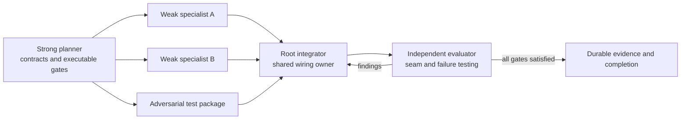

# Strong-Planner / Weak-Implementer Reliability Analysis

**Date:** 2026-07-27

**Status:** Analysis and design input for a future Skill

**Primary audience:** The agent that will convert this analysis into a reusable
Codex Skill

**Case study:** Mochi ordinary-Chat adaptive runtime, especially commit
`76f46b7d`

**Purpose:** Define why detailed implementation plans still fail when a weaker
coding model performs the implementation, and specify a workflow that turns a
strong planner's reasoning into contracts, dispatch envelopes, executable
acceptance gates, and independent integration review.

This document is not the Skill itself. It is the source analysis that the Skill
author should convert into a concise `SKILL.md`, focused references, optional
supporting scripts, a structural plan validator, and forward-test fixtures.

---

## 1. Executive conclusion

The central failure mode is not that a weaker model cannot write classes,
functions, tests, or UI components. It is that the model tends to complete
locally visible artifacts while losing cross-component invariants.

In the case study:

- the lifecycle class existed, but the application never started it;
- the pure recovery policy supported pre-effect replanning, but Engine blocked
  the same case before invoking the policy;
- recovery scope was described to the model but not enforced at the tool
  boundary;
- backend and frontend SSE implementations were individually plausible but
  used different envelope contracts;
- an outbox looked CAS-protected, but the boolean predicate admitted duplicate
  claims;
- range and reconnect tests covered one event per sequence and missed sibling
  events sharing the same sequence;
- all focused tests passed because they largely mirrored the implementation's
  local assumptions.

The reusable lesson is:

> A plan for a weaker implementer must not be primarily prose. It must be an
> executable implementation package in which every important requirement is
> converted into an invariant, assigned to an enforcement owner, challenged by
> a concrete counterexample, and closed by an acceptance gate that crosses the
> relevant integration seam.

The future Skill should help a strong planning model produce that package. It
should not attempt to make the weaker model “reason harder” through motivational
prompting.

---

## 2. Intended operating model

This analysis uses four distinct roles.

### 2.1 Strong planner

The strongest available model inspects the repository, reconstructs the real
control flow, freezes public contracts, derives invariants and failure cases,
and writes the implementation plan and dispatch envelopes.

The planner does not mark a phase complete merely because the required files or
symbols exist.

### 2.2 Weak implementer

A cheaper or less capable coding model receives one bounded package at a time.
It implements only the assigned files and public surface, writes or activates
the specified focused tests, and returns a structured handoff.

It does not choose architecture, invent shared interfaces, modify coordinator
hot spots, or interpret underspecified safety requirements.

### 2.3 Root integrator

One owner integrates packages into shared entrypoints, lifecycle code,
coordinators, persistence, reducers, and frontend consumers. Integration is
serial at shared hot spots even when pure packages were implemented in
parallel.

### 2.4 Independent evaluator

An agent that did not implement the feature runs adversarial, end-to-end,
restart, concurrency, cancellation, security, and producer/consumer contract
checks. It receives raw artifacts and requirements, not the implementation
agent's explanation of why the code should be correct.

Independence means a fresh context with no implementation rationale or claimed
conclusions. The evaluator must design at least one new falsification probe for
each critical invariant; merely rerunning implementer-authored tests is not
independent evaluation. The plan must reserve an exact adversarial-test path or
temporary harness for this role. The evaluator may not modify production code.

### 2.5 Normative decision rules

The future Skill should use the following definitions rather than leaving the
terms to each implementer.

| Term | Decision rule | Who decides | Required record |
|---|---|---|---|
| Applicable | The target control flow owns, crosses, emits, persists, consumes, or can fail at the named boundary | strong planner; evaluator may challenge | code/test evidence or `N/A` record |
| Critical invariant | Violation can cause unauthorized or duplicate effects, security/scope escape, data loss, unrecoverable corruption, unsafe retry, silent durable-work loss, or incompatible public behavior | strong planner before dispatch | severity, concrete counterexample, owner, blocking gate |
| Phase-exit invariant | An invariant explicitly marked `phase_exit=yes` in the invariant register because the named phase cannot truthfully advance without it, even if its failure is not independently critical | strong planner before dispatch; only the evaluator may challenge removal | phase ID, owner, gate, and completion evidence |
| Blocking invariant | A critical invariant, or an explicit phase-exit invariant, whose required gate is absent, failing, or contradicted by evidence | Root or evaluator | failing evidence and affected phase |
| `N/A` | The boundary is absent from the traced production path, not merely inconvenient to test | strong planner; evaluator may reject | deciding role, rationale, and exact evidence |
| Real store | The same persistence implementation and locking/transaction boundary used by the target deployment configuration | strong planner | configured backend, root/database identity, isolation assumptions |
| Independent owner | A separately constructed runtime owner with no shared object-level lock; use separate OS processes when claiming cross-process safety | strong planner | process/repository identities and synchronization method |

A critical or phase-exit invariant cannot be waived as `N/A`. If applicability
is uncertain, the item remains blocking until the planner resolves it.
Every phase-exit invariant must be a normal row in the invariant register; an
acceptance-matrix row or prose exit gate does not become a phase-exit invariant
unless it is explicitly marked there.

Every resource also needs an explicit ownership tuple:

```text
(scope, cardinality, persistence domain, exclusivity mechanism)
```

For example, “one worker” is incomplete. The default rule is “one local worker
per enabled application instance; every instance in the same process owns its
own lifecycle, while claims are exclusive per persistence root through
store-level CAS/leases across both application instances and processes.” If a
framework guarantees exactly one application instance per process, the plan
may collapse those scopes only with evidence. Tests must exercise the declared
local cardinality and the cross-owner persistence rule.

The default weak-implementer capability profile is:

- can implement a frozen local contract and run named commands;
- cannot be relied on to discover hidden callers or invent concurrency,
  lifecycle, security, or cross-layer semantics;
- receives one subsystem and one primary responsibility per package;
- owns at most three production files and three focused test files unless the
  planner records why a larger package remains mechanically bounded;
- may ask for clarification or return `blocked`, but may not relax a gate.

The plan must record exact model identity, context/tool limits, repository
access, and any deviation from these defaults. Package size should be reduced
when the implementation model has weaker repository navigation, contract
inference, concurrency reasoning, or test-debugging ability.



---

## 3. Evidence from the case study

The following findings were observed while reviewing `76f46b7d`.

| Observed implementation | Hidden invariant that was missed | Why focused tests stayed green | Lesson for the Skill |
|---|---|---|---|
| `LearningRuntime.start()` and `stop()` existed | The application owner must start exactly one local worker per application instance, stop it during shutdown, and define cross-instance coordination | The runtime lifecycle was tested directly, not through application startup | Require an application-lifecycle matrix, ownership tuple, and a real app-level test |
| Failure candidates were durably appended | Normal application processing must eventually drain pending candidates | Standalone Engine behavior was tested, which correctly permits pending work | Separate standalone behavior from application-owned behavior |
| Outbox transitions used `append_event_if()` | A claim transition must be exclusive across repository and process instances | Tests used one in-memory repository and one worker | Require separate process owners over one real persistence root when claiming cross-process safety |
| Recovery context contained `allowed_targets` | Scope must be enforced before side effects, even if the model ignores instructions | Tests asserted prompt/context content rather than an attempted scope escape | Forbid prompt-only enforcement of safety invariants |
| Pure `RecoveryPolicy` allowed `operation=None` | The Engine must actually route pre-effect failures into that policy path | Pure policy tests did not invoke the ordinary-Chat entrypoint | Every critical pure-contract case needs one integration counterpart |
| Backend emitted named adaptive-runtime SSE records | The frontend frame reader must decode the exact same envelope | Backend test searched response text; frontend reducer tests used constructed objects | Require a frozen producer fixture consumed by the real frontend parser |
| Multiple derived events reused one sequence | A reconnect/range cursor must not skip unconsumed events at the same sequence | Route test used a single plan event | Require page-boundary tests with the smallest legal limit |
| Projection exposed many counters | Every reported counter must have a real source and a nonzero test | Tests checked the projection shape, not counter provenance | Require a metric provenance table and a nonzero fixture for each counter |

### 3.1 Green tests were not sufficient evidence

During review:

- the new Wave 2 and projection-focused Python group passed: `29 passed`;
- the current working-tree turn-contract group passed: `21 passed`;
- the frontend ordinary-Chat reducer test passed;
- ESLint reported no errors.

Two minimal counterexamples still reproduced defects:

```text
claim_owners=['worker-a', 'worker-b']
claim_transitions=[
  ('claimed', 'worker-a', 'failure-learning:e:claimed:1'),
  ('claimed', 'worker-b', 'failure-learning:e:claimed:1')
]
```

```text
turn_execution_checkpoint  sequence=1
complexity_decision        sequence=1
tool_retrieval_result      sequence=1
recovery_decision          sequence=1

after_sequence=1 => no remaining events
```

The Skill must therefore teach the planner to distinguish:

- component existence;
- component-local correctness;
- integration wiring;
- runtime ownership;
- failure safety;
- replay correctness;
- completion evidence.

---

## 4. Failure taxonomy

The future Skill should use this taxonomy while reviewing or generating a plan.
The names may be shortened in `SKILL.md`; detailed explanations belong in a
reference file.

### F1. Local-completion bias

The implementer satisfies the nearest visible request:

- create the class;
- expose the method;
- add a route;
- add a reducer;
- make the unit test pass.

It does not trace whether a real entrypoint ever calls the new code.

**Required planner response:** Name the entrypoint, caller chain, lifecycle
owner, and end-to-end test.

### F2. Contract-shaped implementation

The code has the expected names and serialized fields but not the expected
semantics. Examples include:

- a `start()` method no owner calls;
- an idempotency key that still permits duplicate writes;
- a cursor field that cannot uniquely resume;
- a counter that can never increment.

**Required planner response:** Define behavioral postconditions and
counterexamples, not only types and field names.

### F3. Advisory-as-authority confusion

A requirement is written into a system prompt or corrective message and then
treated as enforced.

This is unacceptable for:

- filesystem or resource scope;
- authorization and approval;
- side-effect idempotency;
- budget enforcement;
- evidence identity;
- completion authority.

**Required planner response:** Assign each invariant to a deterministic host
boundary. Prompts may improve behavior but must not be the sole enforcement
layer.

### F4. Pure/integration divergence

The pure policy behaves correctly in isolation, but an earlier integration
branch prevents that case from reaching the policy, or a later branch discards
its decision.

**Required planner response:** Pair important pure tests with at least one test
through the production entrypoint.

### F5. Producer/consumer drift

Both sides of an interface compile independently but disagree on:

- event name versus payload type;
- optional versus required fields;
- cursor semantics;
- version negotiation;
- terminal or provisional authority;
- ordering and deduplication.

**Required planner response:** Freeze one transport fixture and make the actual
consumer parse the actual producer output.

### F6. Lifecycle and ownership omission

The plan does not answer:

- who creates the object;
- whether ownership is process-, application-, engine-, request-, or
  session-scoped;
- who starts and stops it;
- what reload does;
- what restart does;
- what multiple instances sharing persistence do;
- whether standalone use differs from application use.

**Required planner response:** Include a lifecycle matrix and owner-specific
tests.

### F7. Concurrency happy-path substitution

An in-memory single-owner test is used to claim CAS, lease, idempotency, or
multi-engine safety.

**Required planner response:** Match the test boundary to the claim. For
same-process safety, use independently constructed repositories that share no
object-level lock. For cross-process safety, use separate OS processes over the
real configured store, synchronized after the competing read and before the
conditional write. A two-object single-process test cannot prove a
cross-process property.

### F8. Same-author test mirroring

The same model writes code and tests from the same mistaken mental model. Tests
assert the representation it just produced instead of challenging the
requirement.

**Required planner response:** Prepare adversarial specifications before
implementation and reserve final evaluation for a separate agent.

### F9. Boundary-value blindness

Normal values pass, but legal minima, maxima, empty states, same-revision
siblings, partial pages, malformed records, cancellation, and restart are not
examined.

**Required planner response:** Derive equivalence classes and boundary cases
from the contract before dispatch.

### F10. Context dilution

A single implementation task spans too many files, layers, and concepts. As the
model progresses, earlier constraints fall out of effective attention.

**Required planner response:** Split pure packages from shared wiring. Keep one
write owner per file per wave. Give the implementer a bounded read-first list
instead of the whole repository.

### F11. Silent completion laundering

Checkboxes or status text are updated because files and tests exist, even
though required integration, negative tests, or evidence are missing.

**Required planner response:** Define phase exit gates before implementation.
Only the integrator may mark integration phases complete, and only with recorded
evidence.

### F12. Observability without provenance

Dashboards or response objects expose counters that are placeholders,
unreachable, or computed from the wrong storage scope.

**Required planner response:** For every metric, specify source event, emission
owner, aggregation logic, reset/scope semantics, and a fixture that makes it
nonzero.

---

## 5. Why a longer natural-language plan is not enough

The original adaptive-runtime plan was already unusually explicit. It included:

- architecture decisions;
- pure package boundaries;
- file ownership;
- safety invariants;
- required tests;
- rollout phases;
- a dispatch envelope;
- explicit instructions for implementation agents.

It still left room for failure because prose has no mechanical authority.

For a weaker implementer, the following statements remain underspecified:

```text
Wire the worker into application lifecycle.
Recovery cannot expand scope.
SSE reconnect must work.
Multiple engines sharing the session root must be safe.
Add metrics and counters.
```

Each must be compiled into a more concrete form:

```text
Requirement
→ invariant
→ enforcement owner
→ exact integration seam
→ prohibited behavior
→ counterexample
→ executable acceptance test
→ evidence required to close
```

The future Skill should perform this compilation step. Merely adding more
warnings to prose will increase token cost without reliably changing behavior.

---

## 6. Mature practices to preserve

The current project plan already identifies useful patterns from mature agent
systems and local references:

- planning as durable state or a bounded tool, not a separate mandatory mode;
- cheap no-op behavior for simple turns;
- deferred tool disclosure;
- deterministic validation feedback;
- strict retry and iteration limits;
- checkpoints and replayable state;
- discovery separated from authorization;
- one orchestrator integrating independently owned specialist packages;
- evaluator agents challenging integrated behavior;
- shared runtime hot spots owned by one integrator.

Relevant local sources are listed in:

- `docs/superpowers/plans/2026-07-26-ordinary-chat-adaptive-agent-runtime-implementation-plan.md`,
  Sections 18–20;
- `reference/cc-haha` for model-triggered planning and tool discovery;
- `reference/openclaw` for execution contracts and bounded continuation;
- `reference/zeroclaw` for activated tool sets and per-iteration schema
  rebuilding;
- `reference/hermes-agent` for durable todo state and rehydration.

The process Skill should generalize the underlying engineering method rather
than copy project-specific names:

1. make state explicit;
2. make authority deterministic;
3. separate selection from permission;
4. bound retry and recovery;
5. persist before asynchronous processing;
6. give every shared seam one owner;
7. test the real producer and consumer together;
8. require evidence before completion.

---

## 7. Required output of the future planning Skill

The Skill should cause a strong planner to produce an implementation package
with the following sections. A plan missing any applicable section should be
reported as incomplete rather than silently filled with generic language.

### 7.1 Plan metadata

- objective;
- repository root;
- baseline commit, dispatch fingerprint, and working-tree fingerprint protocol;
- target entrypoint;
- target runtime behavior;
- explicit non-goals;
- implementation model capability assumption;
- known dirty files and preservation rules;
- authoritative instructions and references read.

The fingerprint protocol uses three named artifacts:

- `baseline_manifest`: state inspected when the plan is frozen;
- `dispatch_manifest`: state immediately before the package is assigned;
- `handoff_manifest`: state returned by the implementer.

Each manifest has a SHA-256 digest and contains:

1. baseline commit;
2. staged binary diff hash for the relevant scope;
3. unstaged binary diff hash for the relevant scope;
4. sorted relevant untracked paths and their content hashes;
5. content hashes for every read-first, owned, and prohibited file that exists.

The plan generator must use one documented byte encoding and path-normalization
rule. At dispatch, every non-owned relevant file must still match the baseline;
any drift requires a Root-authored reconciliation record before assignment. At
handoff, changed paths must be a subset of the package's owned files. Changed
owned files are the authorized package delta and are expected to differ; all
read-first-only and prohibited files must match the reconciled dispatch
manifest. A file that is both read-first and owned follows the owned-file rule.
The handoff records the before/after hashes of every authorized delta. The
validator checks structure, path membership, and manifest presence; a separate
fingerprint command computes hashes and verifies bytes.

### 7.2 Current-state evidence map

For every relevant subsystem, record:

- exact file and symbol;
- current caller;
- persistence owner;
- public schema/version;
- relevant existing tests;
- known contradiction or missing seam.

The planner must inspect current code before naming new interfaces.

### 7.3 Entrypoint and control-flow map

At minimum, trace:

```text
user or external entrypoint
→ application owner
→ coordinator
→ pure policy/component
→ side-effect boundary
→ persistence
→ replay/API projection
→ frontend or downstream consumer
→ shutdown/restart
```

If a layer does not apply, the plan must say why.

### 7.4 Invariant register

Use this exact canonical table:

| ID | Applies | Classification | Severity | Phase exit | Invariant | Enforcement owner | Layer | Prohibited behavior | Failure example | Planned gates | Planned evidence | Observed evidence | N/A record |
|---|---|---|---|---|---|---|---|---|---|---|---|---|---|
| INV-L1 | yes | critical | high | Phase E | Application-owned workers start once and stop on shutdown | API lifespan | lifecycle | enabled candidate remains pending because no worker starts | start app without lifecycle owner and observe no acknowledgement | `test_app_runtime_lifecycle`; application integration | test name, command, expected observable ack and stopped task | `—` | `—` |
| INV-S1 | yes | critical | high | Phase E | Recovery cannot mutate outside declared targets | tool execution context | side-effect boundary | effectful call reaches an undeclared target | model requests unrelated path | `test_recovery_scope_escape`; host-boundary integration | rejected call plus unchanged out-of-scope file | `—` | `—` |

Rules:

- “The model should” is not an enforcement owner.
- Every safety invariant needs a host-side owner.
- Every invariant needs at least one falsifying example.
- Critical invariants require an integration gate, not only a unit test.
- `Applies` is exactly `yes` or `no`; `Classification` is exactly `critical`
  or `noncritical`; `Severity` is exactly `low`, `medium`, or `high`.
- `Phase exit` is a comma-separated phase ID list or `no`. A value other than
  `no` makes the row a phase-exit invariant.
- For `Applies=yes`, `N/A record` is `—`. For `Applies=no`, owner/gates/evidence
  fields that cannot apply are `—`, and `N/A record` is exactly
  `decider=<strong-planner|evaluator>; rationale=<text>; evidence=<exact
  file:symbol, test, or traced-path artifact>`.
- Critical and phase-exit rows cannot use `Applies=no`.
- `Planned evidence` describes the command, oracle, and durable artifact
  expected before implementation. `Observed evidence` is `—` in a newly
  generated plan and is populated only by handoff, integration, or evaluation.

### 7.5 Interface contract matrix

For every producer/consumer seam:

| Seam ID | Applies | Producer | Consumer | Schema/version | Ordering | Identity/cursor | Error behavior | Contract test | N/A record |
|---|---|---|---|---|---|---|---|---|---|

The same frozen fixture should pass through the real serializer, transport
framing, parser, reducer, and projection when applicable.

For a cursor or replay interface, the contract must additionally freeze:

- the stable total-order key, including the tie-breaker for same-sequence
  siblings;
- cursor identity and whether resumption is inclusive or exclusive;
- page-boundary behavior and duplicate suppression;
- stability across application restart;
- cursor expiry or compaction behavior;
- the exact public response for unknown, stale, or malformed cursors.

Tests such as “limit one” are not complete until they state the expected ordered
records, next cursor, replay duplicates, and terminal response.

### 7.6 Lifecycle matrix

| Resource | Applies | Scope | Cardinality | Persistence domain | Exclusivity mechanism | Creator | Starter | Stopper | Reload behavior | Restart recovery | Multi-instance rule | N/A record |
|---|---|---|---|---|---|---|---|---|---|---|---|---|

This section is mandatory for workers, caches, stores, managers, sockets,
background tasks, leases, and application services.

### 7.7 State-transition table

For durable or concurrent state, define:

- valid states;
- legal transitions;
- compare-and-swap precondition;
- idempotency identity;
- lease owner and expiry;
- crash points;
- replay behavior;
- malformed-record behavior;
- terminal states.

Example:

| State ID | Applies | Current | Action | Required predicate | Next | Duplicate action | Crash recovery | N/A record |
|---|---|---|---|---|---|---|---|---|
| OUTBOX-1 | yes | pending | claim | current record still equals observed pending record | claimed(owner, lease) | no second append | reclaim only after expiry | `—` |

These conditional tables use the invariant register's exact `Applies` and
`N/A record` rules. When the whole concern is absent, include one identified
`Applies=no` row rather than leaving the table empty.

### 7.8 Failure-model and boundary matrix

The plan must classify at least:

- missing;
- empty;
- malformed;
- stale;
- duplicate;
- out of order;
- same revision/sequence;
- minimum and maximum page size;
- timeout;
- cancellation before and after side-effect boundary;
- process crash;
- application restart;
- two owners sharing persistence;
- unknown side-effect outcome;
- approval pending/applied/denied;
- weak-model instruction violation;
- unavailable dependency;
- partial persistence failure.

Use this exact table rather than an unstructured list:

| Case | Applies | Enforcement owner | Counterexample | Planned gate | Planned evidence | Observed evidence | N/A record |
|---|---|---|---|---|---|---|---|

Use the same `Applies`, evidence-stage, and `N/A record` serialization rules as
the invariant register.

### 7.9 Package and ownership manifest

Use one row per package:

| Wave | Package | Responsibility | Owned production files | Owned test files | Read first | Prohibited files | Frozen contracts | Acceptance commands | Root wiring deferred | Size-exception rationale | Status | Blocked from |
|---|---|---|---|---|---|---|---|---|---|---|---|---|

List multiple values inside a cell with HTML `<br>` separators. Use `—` only
when the schema explicitly permits absence. `Size-exception rationale` must be
`—` when the package owns at most three production and three test files; it is
required otherwise. `Blocked from` is `—` unless status is `blocked`, when it
must contain the prior state.

One file has one write owner per wave.

A wave is a set of concurrently dispatchable packages with disjoint write
ownership and frozen shared contracts. Ownership transfers only at a recorded
wave barrier after all current owners have handed off. If integration or
evaluation finds a mid-wave defect, Root either:

1. returns it to the current owner;
2. closes the package and records an explicit transfer; or
3. opens a new repair wave with a new owner.

Another role must not silently edit a currently owned file. The evaluator owns
only its declared adversarial-test area or temporary probe harness.

### 7.10 Integration order

The plan must distinguish:

1. pure package completion;
2. shared wiring;
3. persistence and replay;
4. consumer integration;
5. lifecycle integration;
6. adversarial evaluation;
7. rollout.

Do not mark a functional phase complete when only its pure package is complete.

### 7.11 Evidence protocol

Planning evidence and observed execution evidence are different records. The
generated plan contains planned gates and expected oracles; it must never
invent diffs or test outputs. Each package handoff, integration record, and
evaluation record appends observed evidence.

For every executable work item, the final evidence record requires:

1. invariant restatement;
2. failing or adversarial test evidence;
3. scoped production diff;
4. focused test result;
5. seam/integration test result where applicable;
6. phase regression result;
7. working-tree status;
8. exact status from the state machine below.

These terms must not be treated as synonyms.

| Status | Entry criteria | Authority | Next state |
|---|---|---|---|
| `planned` | contracts, ownership, gates, and expected evidence are frozen | strong planner | `assigned` or `blocked` |
| `assigned` | dispatch fingerprint reconciles and one package owner accepts the envelope | Root | `in_progress` or `blocked` |
| `in_progress` | owner has begun the bounded package and no stop condition is active | package owner | `implemented` or `blocked` |
| `implemented` | owned code and focused gates pass; diff and handoff are complete | package owner | `integrated` or `blocked` |
| `integrated` | Root wired the production seam and applicable lifecycle, interface, persistence, and regression gates pass | Root only | `verified` or `blocked` |
| `verified` | independent evaluator added new probes, found no blocking invariant violation, and all phase-exit evidence is durable | evaluator recommends; Root records | terminal for the scoped phase |
| `blocked` | a stop condition, missing authority, contract conflict, or failed blocking gate prevents safe progress; `blocked_from` records the prior state | any role may report; Root records scope | the recorded prior state only after resolution evidence, or terminal escalation |

Statuses attach to exactly one named `package` or `phase` record, never to a
free-floating checkbox. A package being `implemented` does not advance its
parent phase to `integrated`. A pre-dispatch conflict is `blocked` from
`planned`; an unchecked narrative checklist has no status.

### 7.12 Canonical serialization contract

The future `plan-template.md` must copy this heading order exactly:

```text
# <objective>
## 1. Plan metadata
## 2. Capability and authority
## 3. Current-state evidence
## 4. Entrypoint and control flow
## 5. Invariant register
## 6. Interface contracts
## 7. Lifecycle matrix
## 8. State transitions
## 9. Failure boundaries
## 10. Package ownership
## 11. Integration order
## 12. Acceptance gates
## 13. Evidence ledger
## 14. Dispatch envelopes
## 15. Stop and escalation conditions
```

No heading is omitted. If a conditional concern is absent, its section contains
the canonical applicability table and an evidenced `N/A` row; empty prose is
invalid. The exact tables defined in Sections 7 and 9 are normative, not
examples. The remaining canonical tables are:

| Section | Exact columns |
|---|---|
| Plan metadata | `Field`, `Value` |
| Capability and authority | `Role`, `Model ID`, `Context limit`, `Tool access`, `Repository access`, `Known limits`, `Qualification evidence` |
| Current-state evidence | `Subsystem`, `File:symbol`, `Current caller`, `Persistence owner`, `Schema/version`, `Existing tests`, `Contradiction or missing seam` |
| Entrypoint and control flow | `Step`, `Owner`, `File:symbol`, `Input`, `Output`, `Failure path`, `Evidence` |
| State transitions | `State ID`, `Applies`, `Current`, `Action`, `Required predicate`, `Next`, `Duplicate action`, `Crash recovery`, `N/A record` |
| Integration order | `Order`, `Owner`, `Inputs`, `Shared seam`, `Required gates`, `Output artifact` |
| Evidence ledger | `Artifact ID`, `Scope kind`, `Scope ID`, `Invariant IDs`, `Stage`, `Command or diff`, `Result`, `Artifact path or hash`, `Recorded by`, `Status` |
| Stop and escalation conditions | `Condition`, `Detecting role`, `Affected scope`, `Required evidence`, `Allowed next action`, `Authority` |

Every `Field` required by Section 7.1 appears as one plan-metadata row.
`integration_repair_budget` is also mandatory and is an integer of at least
zero; it bounds evaluator-to-Root repair cycles for each generated
implementation phase. It is distinct from the future Skill's own
forward-test revision budget.

Markdown tables use backslash-escaped `\|` for literal pipe characters and
HTML `<br>` for multiple values inside one cell. Duplicate canonical headings,
unescaped cell pipes, invented status values, blank required cells, and
unchecked placeholders such as `TBD`, `TODO`, `???`, or `<fill me>` are
structural errors. The em dash sentinel `—` is permitted only where these
rules explicitly allow absence.

---

## 8. Recommended planning and implementation workflow

### Phase A — Strong planner reconnaissance

1. Read repository instructions completely.
2. Record baseline commit and dirty worktree.
3. Identify the ordinary production entrypoint.
4. Trace existing callers before proposing new contracts.
5. Inspect mature local references selected by the task.
6. Identify shared hot spots and lifecycle owners.
7. Run or inspect current focused tests to establish a baseline.

**Exit gate:** The planner can explain the current end-to-end control flow and
name every shared owner without guessing.

### Phase B — Compile requirements into invariants

1. Rewrite each requirement as an observable invariant.
2. Assign an enforcement owner.
3. Identify advisory versus authoritative layers.
4. Add one concrete failure example.
5. Add unit and integration acceptance gates.
6. Add observability required to diagnose failure.
7. Mark assumptions that require user authority.

**Exit gate:** No safety or durability requirement depends only on model
obedience or untested prose.

### Phase C — Freeze contracts and test fixtures

1. Freeze schema versions, event names, IDs, cursor semantics, and errors.
2. Produce canonical valid and invalid fixtures.
3. Make real consumers parse producer fixtures.
4. Define state transitions and CAS predicates.
5. Define lifecycle and restart ownership.
6. Write adversarial test specifications before production implementation.

**Exit gate:** Specialist packages can implement against stable contracts
without independently choosing architecture.

### Phase D — Dispatch weak implementers

For each package, the weak implementer must:

1. read only the assigned plan sections and references;
2. restate the invariants and forbidden behaviors;
3. activate or write the specified failing tests;
4. implement the smallest owned change;
5. run focused tests;
6. inspect the scoped diff;
7. return a structured handoff;
8. stop rather than edit an unowned shared file.

The implementer must not mark the parent functional phase complete.

### Phase E — Root integration

1. Integrate one package at a time.
2. Wire shared entrypoints and lifecycle.
3. Run the paired pure/integration cases.
4. Run producer/consumer contract fixtures.
5. Run real-persistence restart and concurrency tests.
6. Run cancellation, approval, and unknown-side-effect tests.
7. Verify metrics have real sources.
8. Update status only after durable evidence exists.

### Phase F — Independent evaluation

1. Give the evaluator requirements, frozen fixtures, and integrated artifact.
2. Do not provide the implementation agent's expected conclusions.
3. Give it a declared adversarial-test path or temporary probe harness.
4. Require at least one newly designed falsification probe per critical
   invariant.
5. Run minimum-limit, multi-owner, malformed, restart, and scope-escape cases.
6. Return findings to Root.
7. Repeat only within the generated plan's `integration_repair_budget`; fail
   or escalate when that per-phase budget is exhausted. This is not the Skill
   revision budget used by forward testing in Section 14.

### Phase G — Rollout and documentation

1. Run the representative end-to-end matrix.
2. Measure no-op overhead and activated overhead.
3. Verify feature flags and rollback.
4. Distinguish working-tree, committed, released, and enabled status.
5. Record known limitations honestly.

---

## 9. Mandatory acceptance matrix

The generated plan must use this exact acceptance-gate table:

| Gate ID | Gate class | Applies | Invariant IDs | Owner | Command | Oracle | Planned evidence | Observed evidence | N/A record |
|---|---|---|---|---|---|---|---|---|---|

It selects applicable classes from the reference catalog below. The
`Applies`, evidence-stage, and `N/A record` rules are the same as the invariant
register. A gate is not executable unless `Command` names an exact command or
test selector and `Oracle` states the observable pass condition.

Reference catalog:

| Gate | What it catches | Minimum form |
|---|---|---|
| Pure contract | serialization and local policy errors | strict round-trip and invalid-field tests |
| Production entrypoint | dead or bypassed components | invoke through real entrypoint |
| Lifecycle | unstarted/unowned workers and leaked tasks | app startup, work observed, shutdown |
| Producer/consumer | transport drift | actual producer output parsed by actual consumer |
| Persistence | fake-store assumptions | real configured store |
| Restart | lost work and unsafe replay | crash at each durable boundary, reconstruct owner |
| Concurrency | duplicate claims and stale CAS | separate processes sharing the real store when cross-process safety is claimed |
| Pagination/reconnect | cursor gaps | frozen total order and cursor semantics; limit one, same-sequence siblings, restart, unknown cursor |
| Cancellation | ambiguous completion | cancel before and after side-effect boundary |
| Approval | replayed or skipped effects | pending, approved, denied, already applied |
| Unknown side effect | unsafe retry | fail closed without repeating operation |
| Scope escape | prompt-only security | weak model requests an undeclared target |
| Malformed input | optimistic fallthrough | fail closed with bounded public error |
| Observability | placeholder counters | fixture makes each declared metric nonzero |
| History isolation | synthetic/internal state leakage | model history excludes projections and hidden state |
| Rollback | irreversible enablement | disable new behavior while retaining readable state |

---

## 10. Instructions the Skill should impose on generated plans

### 10.1 Forbidden vague instructions

Reject or rewrite phrases such as:

- “wire it up”;
- “handle concurrency”;
- “ensure replay safety”;
- “add observability”;
- “respect allowed targets”;
- “support restart”;
- “test edge cases”;
- “follow existing patterns”.

Each must name the owner, seam, counterexample, and test.

### 10.2 Forbidden completion shortcuts

- Do not equate a class with application integration.
- Do not equate a method with a caller.
- Do not equate a schema with semantic compatibility.
- Do not equate a prompt instruction with policy enforcement.
- Do not equate an in-memory test with cross-process safety.
- Do not equate a backend route test with frontend compatibility.
- Do not equate green focused tests with phase completion.
- Do not allow the same implementation model to be the sole evaluator.

### 10.3 Required stop conditions for weak implementers

Stop and return to Root when:

- a frozen contract contradicts current shared code;
- the required fix touches an unowned file;
- a side-effect outcome is unknown;
- a safety invariant lacks a deterministic enforcement owner;
- a real consumer or lifecycle owner cannot be identified;
- the test would need to assert an invented contract;
- user-owned dirty work overlaps the change;
- passing the gate requires weakening or deleting the gate.

---

## 11. Suggested Skill packaging

### 11.1 Suggested name

Preferred:

```text
plan-for-weaker-agents
```

Alternative:

```text
implementation-plan-guardrails
```

The first name is clearer about the operating model. The final name should
remain lowercase, hyphenated, and under 64 characters.

### 11.2 Suggested trigger description

The description should cover both the action and the triggering conditions,
for example:

> Produce invariant-driven, executable implementation plans designed for less
> capable coding agents. Use when work spans multiple modules, lifecycle,
> persistence, API/frontend seams, concurrency, security boundaries, replay,
> background workers, or multi-agent implementation packages, and when a strong
> planner must constrain weaker implementers with exact ownership, contracts,
> counterexamples, tests, integration gates, and evidence requirements.

The Skill author should tighten this wording while preserving those triggers.

### 11.3 Recommended folder contents

```text
plan-for-weaker-agents/
├── SKILL.md
├── agents/
│   └── openai.yaml
├── references/
│   ├── plan-template.md
│   ├── failure-taxonomy.md
│   ├── acceptance-matrices.md
│   └── dispatch-envelope.md
├── scripts/
│   └── validate_plan.py
└── tests/
    ├── fixtures/
    │   ├── valid-complete-plan.md
    │   ├── invalid-missing-owner.md
    │   ├── invalid-vague-gates.md
    │   ├── invalid-package-ownership.md
    │   ├── invalid-status-vocabulary.md
    │   ├── invalid-na-record.md
    │   ├── invalid-size-exception.md
    │   ├── invalid-duplicate-heading.md
    │   └── invalid-placeholder.md
    ├── forward/
    │   └── <eight scenario packages from Section 14.2>
    └── test_validate_plan.py
```

Do not add a README, changelog, or installation guide.

### 11.4 What belongs in `SKILL.md`

Keep the core workflow concise:

1. inspect current control flow;
2. derive invariant register;
3. assign enforcement owners;
4. freeze interfaces and fixtures;
5. generate package ownership;
6. generate acceptance gates;
7. reserve shared wiring for Root;
8. require independent forward testing.

The body should tell the planner when to read each reference.

### 11.5 What belongs in references

- `plan-template.md`: the full implementation-package schema from Section 7;
- `failure-taxonomy.md`: Section 4 with examples;
- `acceptance-matrices.md`: Section 9 plus framework-neutral test patterns;
- `dispatch-envelope.md`: exact package handoff and completion-evidence
  templates.

Every framework-neutral test pattern uses this record:

| Pattern ID | Claim boundary | Setup | Synchronization or fault injection | Trigger | Oracle | Anti-oracle | Required artifact |
|---|---|---|---|---|---|---|---|

`acceptance-matrices.md` must instantiate it for lifecycle, real-store restart,
same-process independent owners, cross-process owners, producer/consumer
transport, same-order-key pagination, cancellation around the side-effect
boundary, scope escape, and metric provenance. Framework-specific commands
remain plan inputs; the setup, trigger, oracle, and anti-oracle do not.

Avoid duplicating the same material in `SKILL.md`.

### 11.6 Validation responsibilities

The official Skill-package validator required by the current `skill-creator`
instructions is mandatory. The Skill author must read those current
instructions, use their canonical schema for `agents/openai.yaml`, and record
the exact official validation command and output; this analysis intentionally
does not freeze an environment-specific validator path.

A custom `validate_plan.py` is mandatory for the proposed Skill. The Skill
must emit the canonical Markdown plan format using the exact headings and
pipe-table columns defined by Section 7.12 and copied verbatim into
`plan-template.md`.

The validator contract is:

```text
python scripts/validate_plan.py PATH

exit 0: structurally valid; stdout is "VALID <normalized-path>"
exit 1: plan validation errors; stderr has one diagnostic per line
exit 2: CLI, unreadable-file, decode, or parser failure

diagnostic:
<normalized-path>:<line>:<column>: <CODE> <message>
```

It targets Python 3.11 or newer and uses only the standard library. Input is
UTF-8 without a BOM; paths in the plan use repository-relative forward slashes.
Diagnostics are sorted by line, column, and code. The validator rejects
duplicate canonical headings, missing or reordered headings, unknown table
columns, unescaped pipe characters, and malformed rows. It validates explicit
fields rather than trying to infer from prose whether lifecycle, interfaces,
or concurrency apply.

It must check all of these structural properties:

- required sections are present;
- every applicable invariant has classification, severity, phase-exit value,
  owner, prohibited behavior, failure example, planned gates, and planned
  evidence;
- every `Applies=no` row has a canonical `N/A record`, while critical and
  phase-exit invariants cannot be `N/A`;
- every package has owned files, prohibited files, tests, deferred wiring,
  valid status, and a size exception when either file limit exceeds three;
- no two packages in one wave own the same file;
- applicable lifecycle resources have scope, cardinality, persistence domain,
  exclusivity, creators, starters, and stoppers;
- applicable producer/consumer rows have a contract test;
- all acceptance gates name exact invariant IDs, commands, and oracles;
- the three fingerprint manifest references exist structurally and the
  authorized-delta paths are owned; byte-level digest verification remains an
  external command;
- no unchecked placeholder remains;
- status vocabulary is valid.

Its regression suite must contain at least one complete positive fixture and
negative fixtures with these minimum expected diagnostics:

| Fixture | Required diagnostic |
|---|---|
| `invalid-missing-owner.md` | `E110 invariant-owner-required` |
| `invalid-vague-gates.md` | `E120 gate-not-executable` |
| `invalid-package-ownership.md` | `E210 overlapping-write-owner` |
| `invalid-status-vocabulary.md` | `E310 invalid-status` |

`E120` is deterministic: normalize lowercase whitespace in the `Command` and
`Oracle` cells and reject an empty value, `—`, or a value consisting only of a
forbidden vague phrase from Section 10.1. It does not claim to understand
arbitrary prose. Additional regression cases must cover malformed `N/A`
records (`E130`), missing package-size exceptions (`E220`), duplicate headings
(`E010`), and placeholders (`E400`).

The validator must not claim semantic correctness. A plan can satisfy structural
checks and still name the wrong owner or omit a real call path. Independent
review remains mandatory.

---

## 12. Dispatch envelope the Skill should generate

```yaml
workflow_id: stable-workflow-id
wave_id: wave-or-phase-id
package_id: bounded-package-id
task: exact bounded deliverable
status: assigned
integration_repair_budget: 2

capability_profile:
  model_id: exact-model-id
  context_limit: exact-limit
  tool_access:
    - exact-tools
  repository_access: exact-scope
  known_limits:
    - exact-limit
  qualification_evidence: exact-artifact

baseline:
  commit: exact-commit-or-null
  baseline_fingerprint:
    algorithm: sha256
    manifest: exact-manifest-artifact
    digest: exact-digest
  dispatch_fingerprint:
    algorithm: sha256
    manifest: exact-manifest-artifact
    digest: exact-digest
  reconciliation_record: exact-record-or-null
  working_tree_notes:
    - exact dirty files to preserve

read_first:
  - repository instructions
  - exact plan sections
  - exact contract files
  - selected reference files

owned_files:
  production:
    - exact/file.py
  tests:
    - exact/test_file.py
package_size_exception: null-or-exact-rationale

prohibited_files:
  - shared/coordinator.py

evaluation_test_area:
  - exact/adversarial/test_path

invariants:
  - id: INV-EXAMPLE
    applies: true
    classification: critical
    severity: high
    phase_exit:
      - phase-id
    statement: observable invariant
    enforcement_owner: exact symbol or boundary
    prohibited_behavior: concrete forbidden outcome
    failure_example: concrete counterexample
    planned_gates:
      - gate-id
    planned_evidence: exact-command-oracle-and-artifact
    observed_evidence: null
    na_record: null

public_contract:
  inputs:
    - exact symbols and versions
  outputs:
    - exact symbols and versions
  errors:
    - exact fail-closed behavior

acceptance_gates:
  - id: gate-id
    test: exact test name
    command: exact command
    oracle: exact observable pass condition
    proves:
      - invariant ID

root_wiring_deferred:
  - exact integration task not owned by this package

stop_conditions:
  - exact conditions requiring return to Root

handoff_required:
  - handoff fingerprint and authorized delta
  - changed files
  - invariant-by-invariant status
  - test evidence
  - unresolved integration requests
  - working-tree status
```

The implementer should not receive a vague task such as “implement recovery” or
“add SSE support”.

### 12.1 Implementer handoff

`dispatch-envelope.md` must include this literal handoff schema:

```yaml
workflow_id: stable-workflow-id
wave_id: wave-id
package_id: package-id
status: implemented-or-blocked
blocked_from: in_progress-or-null
handoff_fingerprint:
  algorithm: sha256
  manifest: exact-manifest-artifact
  digest: exact-digest
authorized_delta:
  - path: exact/owned/file
    before_sha256: exact-hash-or-absent
    after_sha256: exact-hash-or-absent
changed_files:
  - exact/owned/file
invariant_results:
  - id: INV-ID
    status: pass-fail-or-blocked
    observed_evidence:
      - exact-command-result-and-artifact
acceptance_results:
  - gate_id: gate-id
    command: exact-command
    exit_code: integer
    result: pass-fail-or-blocked
    artifact: exact-path-or-hash
unresolved_root_wiring:
  - exact-integration-request
working_tree_status: exact-scoped-status-artifact
```

### 12.2 Integration and phase-completion record

Only Root writes this record, after receiving evaluator recommendations:

```yaml
scope_kind: phase
scope_id: exact-phase-id
status: integrated-or-verified-or-blocked
blocked_from: prior-status-or-null
package_handoffs:
  - exact-handoff-artifact
root_integration_diff: exact-diff-artifact
invariant_results:
  - id: INV-ID
    gate_ids:
      - gate-id
    observed_evidence:
      - exact-artifact
evaluator:
  model_id: exact-model-id
  new_probe_artifacts:
    - exact-artifact
  recommendation: verified-or-blocked
regression_artifact: exact-command-output
working_tree_artifact: exact-status-output
recorded_by: root-identity
```

An `integrated` record cannot omit Root's integration diff and applicable seam
gates. A `verified` record cannot omit evaluator-authored new probes. A blocked
record must name `blocked_from`, the violated invariant, and the evidence.

---

## 13. Concrete transformation examples

### 13.1 Application lifecycle

Weak plan:

```text
Create LearningRuntime with start and stop methods.
```

Strong plan:

```text
Invariant INV-L1:
When the API application owns an enabled LearningRuntime, application startup
must start exactly one local worker for that application instance before
accepting dependent work, and shutdown must await its stop. Multiple
application processes sharing a persistence root coordinate claims through the
store-level CAS/lease contract; they do not rely on a process-local lock.

Owners:
- creation: API engine factory
- start: FastAPI lifespan startup or first engine acquisition with idempotent start
- stop: FastAPI lifespan shutdown
- standalone Engine: no automatic worker start

Tests:
- construct TestClient with real SessionStore;
- enter application lifespan;
- submit one candidate through ordinary Chat finalization;
- wait for durable ack;
- assert one worker task;
- exit lifespan and assert stopped;
- repeat with injected standalone Engine and assert pending remains valid;
- start two application processes over one persistence root and assert one
  exclusive claim and one terminal acknowledgement for the candidate.
```

### 13.2 Recovery scope

Weak plan:

```text
Tell the recovery model not to expand scope.
```

Strong plan:

```text
Invariant INV-RS1:
No effectful recovery tool call may target a resource outside the canonical
allowed target set, even when the model requests it.

Owner:
ToolExecutionContext recovery capability guard.

Counterexample:
Declared target is report.md; recovery model calls file_write("unrelated.py").

Acceptance:
Call is rejected before the tool side effect, unrelated.py remains absent,
budget is accounted once, and the final result reports a durable blocker.
```

### 13.3 SSE compatibility

Weak plan:

```text
Add an SSE endpoint and frontend reducer.
```

Strong plan:

```text
Freeze one fixture containing:
- SSE event name;
- data.type;
- schema version;
- session and turn identity;
- unique event cursor;
- payload.

Pass backend encoder output through the real frontend frame reader, strict
transport parser, reducer, disconnect-after-first-frame simulation, range
repair, and reload snapshot.
```

### 13.4 Exclusive claim

Weak plan:

```text
Use append_event_if for CAS.
```

Strong plan:

```text
Start two OS processes, each with its own FailureOutboxRepository, over the same
deployment-configured SessionStore root. Do not share an in-memory lock.
Synchronize both after reading pending and before append. Assert exactly one:
- successful claim;
- claimed transition;
- processor invocation;
- terminal ack.

Repeat after lease expiry and after a crash between telemetry record and ack.
```

---

## 14. Forward-testing the future Skill

The Skill should not be accepted only because its files validate. It needs
behavioral forward tests.

### 14.1 Test protocol

Before running, create a manifest containing:

- exact planner, implementer, Root, and evaluator model IDs;
- context budgets, reasoning settings, tool access, and sampling seed when the
  runtime exposes one;
- immutable scenario repository commit and dirty-state fixture;
- raw task prompt and hidden evaluator checklist;
- the campaign-wide Skill revision count and exact candidate Skill hash.

“Fresh” means a new context with no earlier implementation discussion or
hidden defect checklist. If the runtime has no sampling seed, record
`seed=null`, use fresh contexts, and retain the two-trial minimum; absence of a
seed is not permission to reuse a conversation.

Model-role qualification must use one of these records:

1. a named, dated benchmark or prior repository evaluation that measures
   navigation, contract inference, and cross-component reasoning for both
   exact model configurations; or
2. a held-out pilot scenario run twice per model without this Skill. An
   independent scorer uses the control-flow, invariant, interface, and
   failure-boundary rubric dimensions from Section 14.3. The planner's lower
   trial score must be at least two points above the implementer's higher trial
   score, and the planner may have no zero dimension.

If neither qualification rule is met, experimentation may continue but every
result is labelled provisional and cannot accept the Skill.

For every scenario:

1. Start a fresh strong-planner agent with the frozen manifest.
2. Give it the Skill and the realistic repository task.
3. Do not reveal the hidden failure checklist.
4. Inspect the generated plan for invariants, owners, counterexamples, and
   executable gates.
5. Give one bounded package to the recorded weaker implementation model.
6. Give the package handoff and plan to the recorded Root model. Root performs
   the explicitly deferred shared wiring, runs integration gates, and emits the
   Section 12.2 integration record.
7. Only after that record exists, let an independent evaluator design new
   probes and test the integrated artifact.
8. Capture prompts, generated plan, package handoff, Root integration record,
   diffs, commands, outputs, scores, and
   evaluator findings.
9. Run at least two independent trials per scenario, or record an explicit
   cost-based exception and treat the result as provisional.
10. Revise the Skill only between complete campaign rounds.

The campaign allows at most three edits to the Skill after its initial complete
round, shared across all scenarios rather than reset per scenario. Each edit
increments the candidate hash and revision count. The final candidate must
rerun every scenario twice; results from an older candidate do not count
toward final acceptance. If a blocking failure remains after the third
revision, the Skill fails acceptance and the author must escalate the
unresolved pattern rather than looping indefinitely. This budget is unrelated
to a generated project's `integration_repair_budget`.

### 14.2 Forward-test scenarios

At minimum:

1. **Background worker:** component exists but lifecycle wiring is missing.
2. **CAS outbox:** two repositories share real persistence.
3. **Prompt-only safety:** model is instructed not to escape scope.
4. **Backend/frontend transport:** event name and payload type differ subtly.
5. **Cursor:** multiple events share a sequence and page limit is one.
6. **Pure/integration divergence:** policy supports a case that an earlier
   coordinator branch blocks.
7. **Metrics:** API exposes counters with no emission source.
8. **Dirty worktree:** relevant file contains user changes that must be
   preserved.

These are required executable fixtures, not prompt themes. Before accepting the
Skill, the author must materialize one immutable package per scenario:

```text
forward-tests/<scenario-id>/
├── repository/                 # minimal local repository or reproducible setup
├── BASELINE                    # exact commit and content hash
├── task.md                     # raw planner prompt
├── dirty-state.patch           # explicit empty patch when not applicable
├── hidden-oracle.yaml          # defect, forbidden shortcuts, expected probes
├── integration-commands.yaml   # setup, focused, Root, evaluator, cleanup
└── expected-artifacts.yaml     # plan, handoff, integration, evidence paths
```

Each hidden oracle names the seeded defect, observable failure, required
invariant, minimum counterexample, and what would falsely pass. Commands must
use local deterministic dependencies or pin every external artifact. Cleanup
must operate only inside the fixture copy. The case-study evidence in Section 3
may seed fixtures, but the forward-test repositories must conceal their oracle
from planner and implementer contexts. The five Markdown files in Section 11.3
are validator fixtures and do not satisfy this behavioral requirement.

### 14.3 Evaluation rubric

Score each dimension from 0 to 2:

| Dimension | 0 | 1 | 2 |
|---|---|---|---|
| Control-flow reconstruction | absent | partial | entrypoint through shutdown |
| Invariant quality | prose only | some owners/tests | all critical invariants owned and falsifiable |
| Safety enforcement | prompt-dependent | mixed | deterministic host boundaries |
| Lifecycle | omitted | start/stop named | ownership, reload, restart, standalone, multi-instance |
| Interface seams | separate component tests | shared schema | real producer consumed by real consumer |
| Concurrency | not mentioned | conceptual | synchronized real-store test |
| Failure boundaries | happy path | selected errors | systematic boundary matrix |
| Package ownership | broad task | file list | one-owner manifest and deferred wiring |
| Evidence | generic test command | focused results | invariant-linked completion evidence |
| Independent evaluation | same agent only | review suggested | blind forward test required |

An independent evaluator, not the planner or implementer, assigns applicability
and scores from captured artifacts. Acceptance is normative:

- no dimension scores zero;
- safety, lifecycle, interface seams, and evidence score two for applicable
  tasks;
- every `N/A` records the deciding role, rationale, and evidence;
- each trial score is at least
  `ceil(0.85 × 2 × applicable_dimension_count)`, which is 17/20 when all ten
  dimensions apply;
- a weaker implementer can follow one package without inventing architecture.

Every one of the eight scenarios must have two passing trials on the final
candidate. Scores are not averaged: the lower trial controls, and one failing
trial fails that scenario. A cost-based single-trial exception or unqualified
model pairing remains provisional and cannot produce a final acceptance claim.
The evaluator may mark a dimension `N/A` only when the fixture's traced path
does not contain that concern; the scenario's seeded target dimension is
always applicable.

---

## 15. What the downstream Skill-author agent should deliver

Before writing files, the downstream agent must resolve the intended Skill
installation root from the user's request or current Skill-authoring
environment. It must read the current `skill-creator` instructions for the
canonical metadata schema, initialization command, permitted directories, and
official package validator. Those environment-owned details should not be
guessed or hard-coded from this case study.

The author must write a preflight record before creating files:

```yaml
skill_root: exact-resolved-path
skill_name: plan-for-weaker-agents-or-approved-alternative
skill_creator_source: exact-instruction-artifact
metadata_schema_source: exact-schema-artifact
initialization_command: exact-command
official_validation_command: exact-command
python_command: exact-python-3.11+-command
forward_test_root: exact-resolved-path
```

Missing or unresolved values block authoring. This preserves environment-owned
instructions without forcing the downstream agent to guess them.

The agent receiving this document should:

1. create one focused planning Skill, not a general software-engineering
   encyclopedia;
2. keep `SKILL.md` concise and move detailed templates/taxonomy to one-level
   references;
3. include exact trigger metadata for multi-module, lifecycle, persistence,
   concurrency, security, replay, and producer/consumer planning tasks;
4. include the deterministic structural plan validator and its fixtures;
5. test the custom plan validator with positive and negative fixtures;
6. validate the Skill with the official Skill validator;
7. materialize the eight executable forward-test packages from Section 14.2;
8. forward-test it with fresh agents and raw scenarios;
9. report what the Skill still cannot guarantee;
10. avoid claiming that structural validation replaces code review or
   integration testing.

The Skill should optimize for this outcome:

> A strong planner produces a bounded, invariant-driven implementation package;
> weaker implementers make local changes without inventing shared architecture;
> one Root integrates shared seams; and an independent evaluator must falsify
> the result before the phase is called complete.

---

## 16. Final checklist for the Skill author

- [ ] Skill trigger description names the relevant high-risk task classes.
- [ ] Core workflow begins with repository and control-flow inspection.
- [ ] Applicability, criticality, blocking, and `N/A` use the normative rules.
- [ ] Weak-model capability assumptions constrain package size and decisions.
- [ ] Generated plans contain an invariant register.
- [ ] Every critical invariant has a deterministic enforcement owner.
- [ ] Prompt-only enforcement is explicitly forbidden for safety boundaries.
- [ ] Lifecycle resources require a lifecycle matrix.
- [ ] Durable state requires a transition/CAS/crash table.
- [ ] Producer/consumer seams require shared fixtures.
- [ ] Important pure tests require production-entrypoint counterparts.
- [ ] Concurrency claims require multiple real owners over shared persistence.
- [ ] Cross-process claims use separate processes without shared in-memory locks.
- [ ] Cursor contracts freeze ordering, tie-breakers, resume, and stale behavior.
- [ ] Boundary tests include minimum page size and same-sequence events.
- [ ] Metrics require source-event provenance and nonzero fixtures.
- [ ] Package dispatch uses exact owned and prohibited files.
- [ ] File ownership transfers only at recorded wave boundaries.
- [ ] Root alone owns shared integration hot spots.
- [ ] The implementing agent cannot mark the functional phase complete.
- [ ] Status transitions name evidence and role authority.
- [ ] Independent evaluation adds new falsification probes.
- [ ] Forward testing has a recorded manifest and bounded revision budget.
- [ ] Official Skill validation and custom plan validation are distinguished.
- [ ] Structural plan validation is described as necessary but insufficient.
- [ ] The Skill contains no unnecessary README or auxiliary documentation.
