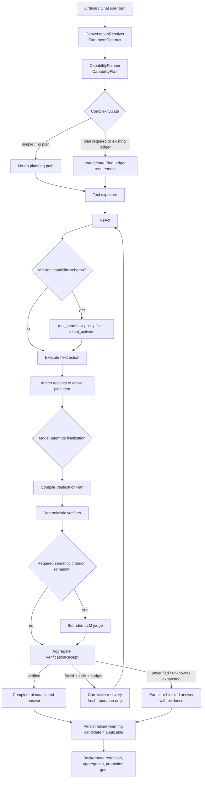
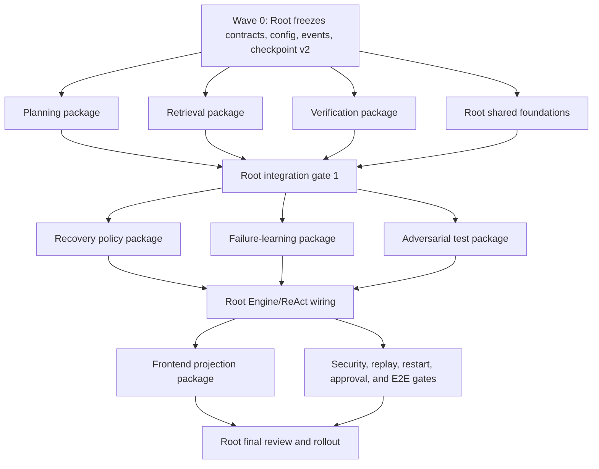

# Ordinary Chat Adaptive Agent Runtime Implementation Plan

> **Audience:** This document is intentionally explicit enough for a weaker
> implementation agent. Execute it sequentially. Do not infer omitted behavior,
> silently broaden scope, or replace the named contracts with an unrelated
> planner/workflow framework.

**Status:** Wave 1 integrated and stabilized; Wave 2 Phase 6/7/A complete; Phase 8 in progress

**Date:** 2026-07-26

**Last progress update:** 2026-07-27

**Target:** Mochi ordinary Chat (`chat -> AgentEngine -> ReAct`)

**Goal:** Add an always-wired, automatically no-op/activate runtime consisting of:

```text
complexity-gated plan state
+ JIT tool retrieval
+ verifier-triggered bounded recovery
+ background failure learning
```

**Architecture pattern:** One ordinary-Chat agent with a deterministic router
and bounded evaluator loop. This is not a new multi-agent Workflow, Goal mode,
Plan mode, Team, CLI flag, or user-visible special entrypoint.

**Primary implementation language:** Python 3.11+

**Primary persistence:** Existing `SessionStore` append-only events with CAS

**Primary execution core:** `mochi/agents/engine.py` and
`mochi/agents/react_loop.py`

---

## Current Progress Snapshot - 2026-07-27

- Wave 1 base implementation is committed in
  `ee420155c617f3e32e9ff759a0f4d684a233d78f`.
- Root review and stabilization are committed in `4ce3ccd0`
  (`fix: stabilize ordinary chat adaptive runtime wave 1`).
- Packages P, T, and V plus their current Root Engine integration are complete
  for the Wave 1 boundary: complexity-gated plan state, bounded JIT retrieval,
  deterministic/semantic verification, durable aggregate receipts, and
  completion invariants.
- Stabilization specifically closed retrieval inflection, zero-cache,
  semantic-judge wiring, target/evidence identity, kill-switch, routine
  approval, ledger/task completion, and receipt replay/idempotency defects.
- Related regression gate: `281 passed`; key retrieval-disable and
  target-evidence gate: `3 passed`; `compileall` and `git diff --check` passed.
- The full-suite observation was `2246 passed, 13 failed, 3 skipped`. The 13
  failures were outside the stabilization paths, so the repository-wide suite
  must not yet be described as green. Ruff was unavailable in this environment.
- Wave 2 recovery policy, failure learning, and adversarial integration have
  been implemented and focused regression gates are green: bounded recovery
  budgets, redacted failure outbox, background worker, and adversarial
  integration.
- Before Phase 8 frontend/replay rollout, resolve the remaining streaming
  contract: a model-authored success final can be observed immediately before
  the authoritative `verification_blocked` final. Either buffer finalization
  until verification or expose/render the earlier event explicitly as
  provisional. Phase 8 now renders such a final as a bounded provisional
  display when the replayed authoritative projection is blocked/partial.
- Phase 8 backend/UI slice is in progress: bounded redacted projection,
  session snapshot/range/SSE replay routes, ordinary-Chat reducer/card, and
  projection counters are implemented. Existing session response shape stays
  backward compatible unless `include_adaptive_runtime=true` is requested.
- Detailed closeout evidence:
  `docs/superpowers/handoffs/2026-07-27-ordinary-chat-adaptive-runtime-wave1-stabilization.md`.

---

## 0. Read This Before Touching Code

### 0.1 Workspace rules

1. Read and obey repository `AGENTS.md`.
2. Prefix every shell command and every segment of a command chain with `rtk`.
3. Prefer `apply_patch` for edits.
4. If `apply_patch` fails with the documented Windows restricted-token error,
   use PowerShell/.NET APIs only after resolving the absolute target and proving
   it is inside the workspace. Preserve encoding and newline style.
5. The 2026-07-26 workspace contains large uncommitted user WIP. Do not stage,
   commit, reformat, delete, reset, or overwrite unrelated files.
6. Do not run a repository-wide formatter over `engine.py`.
7. After each implementation task:

   ```powershell
   rtk git diff -- <touched paths>
   rtk git diff --check
   rtk pytest <focused tests>
   ```

8. Do not claim a task complete because code was written. The task is complete
   only after the specified tests and invariants pass.

### 0.2 Required local reading

Read these files before implementing Phase 1:

- `.claude/skills/agent-memory/memories/architecture/chat-goal-workflow-runtime-current-state-2026-06-27.md`
- `.claude/skills/agent-memory/memories/project-status/tool-activation-capability-adapter-2026-07-24.md`
- `.claude/skills/agent-memory/memories/project-status/agent-tool-workflow-p2-closure-2026-07-26.md`
- `docs/superpowers/plans/2026-07-10-tool-activation-contract.md`
- `docs/superpowers/handoffs/2026-07-26-p2-2-model-history-linearization-evidence.md`
- `mochi/agents/turn_intent_contract.py`
- `mochi/agents/conversation_resolver.py`
- `mochi/agents/model_conversation_interpreter.py`
- `mochi/agents/capability_planner.py`
- `mochi/agents/capability_exposure_adapter.py`
- `mochi/agents/conversation_state_store.py`
- `mochi/agents/artifact_verifier.py`
- `mochi/agents/controlled_recovery.py`
- `mochi/agents/engine.py`
- `mochi/agents/react_loop.py`
- `mochi/agents/prompt_builder.py`
- `mochi/tools/tool_search.py`
- `mochi/tools/tool_activate.py`
- `mochi/tools/registry.py`
- `mochi/tools/registry_factory.py`
- `mochi/sessions/timeline_coordinator.py`
- `mochi/sessions/turn_timeline.py`
- `mochi/learning/types.py`
- `mochi/learning/trajectory.py`
- `mochi/learning/extractor.py`
- `mochi/learning/improver.py`

If any named file moved, locate the current symbol with `rtk rg`. Do not restore
an obsolete module solely because an old plan mentions it.

### 0.3 Existing invariants that must not regress

1. Chat remains the main user entrypoint.
2. Goal/Workflow remains an expert control plane, not a prerequisite for this
   feature.
3. `TurnIntentContract` is the authoritative semantic interpretation.
4. `CapabilityPlanner` consumes a validated contract; it must not interpret raw
   natural language or introduce keyword routing.
5. Capability intent, catalog discovery, schema exposure/activation, concrete
   call authorization, and user approval are different states.
6. `tool_activate` may expose a schema but never authorizes a concrete call.
7. The TimelineCoordinator owns ordinary-Chat FIFO admission and side-effect
   boundaries. Never hold a session/filesystem lock across model generation or
   tool execution.
8. Approval continuation resumes the exact approved operation result. Never
   replay the approved tool call and never rebuild the transcript from scratch.
9. Cancelled or never-claimed turns must not leak into later model history.
10. Display projections are not synthetic assistant history.
11. Unknown side-effect outcome is terminal for automation.
12. Current success-only skill extraction stays success-only.

---

## 1. Terminology: Do Not Conflate These Objects

| Object | Scope | Purpose | Must not contain |
|---|---|---|---|
| `TurnIntentContract` | one user turn | objective, operations, deliverables, constraints, acceptance criteria | tool grants, execution progress |
| `ActiveTaskState` | cross-turn semantic task | durable objective and unresolved deliverables | per-step execution plan |
| `CapabilityPlan` | one turn/model iteration | eligible/exposed tools and artifact obligation | task todo items |
| `PlanLedger` **new** | cross-turn operational progress | ordered/dependent work items and evidence | security grants, raw chain-of-thought |
| `TurnCheckpoint` | one executing turn | resume/recovery snapshot | canonical long-term task meaning |
| `VerificationPlan` **new** | one turn/finalization | typed criteria and verifier routing | commands invented by a model |
| `VerificationReceipt` **new aggregate** | one verification attempt | per-criterion evidence and verdict | self-reported success without evidence |
| `FailureEpisode` **new** | post-turn learning | redacted failure signature and verified correction | raw secrets, hidden reasoning |

### Mandatory naming rule

Do not call `CapabilityPlan` a task plan. In code, diagnostics, tests, and UI:

- use **capability plan** for tool eligibility/exposure;
- use **plan ledger** or **task plan** for executable task steps.

---

## 2. Target Runtime State Machine



### Automatic no-op requirement

All components are wired into ordinary Chat, but each must cheaply return
`not_applicable`/`no_plan`/`no_recovery` when its trigger is absent.

For a simple informational question, the target behavior is:

- no additional complexity-model call;
- no PlanLedger event;
- no `update_plan` schema;
- no tool retrieval call;
- no semantic judge call;
- no recovery pass;
- no failure-learning model call.

---

## 3. Architecture Decisions

### AD-1: Single-agent ordinary-Chat runtime

Use one ReAct runtime with router/evaluator components. Do not invoke
`MultiAgentOrchestrator`, create an `AgentRun`, or require Workflow/Goal.

### AD-2: Hybrid complexity gate

Use deterministic signals first. Call a small structured model advisor only for
the configured grey zone. A model advisory cannot weaken a hard safety rule.

### AD-3: Plan-as-state, not prose

Follow the OpenHands TaskTracker, Deep Agents Todo, Hermes TodoStore, and Codex
`update_plan` pattern:

- structured state;
- main ReAct model updates it;
- no separate Planner agent by default;
- complex tasks only;
- host enforces legal transitions.

### AD-4: Host-enforced planning obligation

Because the implementation model may be weak, do not depend on prompt obedience:

- permit at most a bounded number of read-only pre-plan calls;
- block the first effectful call when a required plan is missing;
- return a structured `plan_required_before_effect` correction;
- allow one correction round by default;
- then block instead of silently proceeding.

### AD-5: JIT retrieval is exposure, not authorization

Keep:

```text
catalog -> policy/capability filter -> rank -> expose schema -> call authorization
```

Discovery state may be remembered, but it never becomes durable authority.

### AD-6: Deterministic verification first

Tests, file hashes, filesystem state, response schemas, exit codes, receipts,
and policy state are stronger than model opinions. A semantic judge is a
fallback for genuinely semantic criteria and can never override a deterministic
failure.

### AD-7: Three/four-state verification

Never map “no verifier understands this” to success:

- `verified`
- `failed`
- `unverified`
- `not_applicable`

`unknown` side-effect state maps to blocked automation, not to `unverified`
success.

### AD-8: Bounded recovery, never blind replay

Default one recovery attempt; hard maximum two. A replacement operation must
receive a fresh operation ID and bind `supersedes_operation_id`. Unknown outcome
or pending approval is not retryable.

### AD-9: Failure learning is separate from skills

Do not change `SkillExtractor` to accept failures. Persist a separate,
redacted `FailureEpisode`; promote only repeated, verified corrections.

### AD-10: State is event-sourced and CAS-protected

Plan changes, verification receipts, recovery decisions, and failure candidates
must be durable events with schema versions and idempotency keys. Do not rely on
process-local dictionaries for correctness.

---

## 4. Proposed Configuration Contract

Add nested Pydantic configuration under `AgentConfig`; do not add per-message
user flags or a special mode.

```python
class ComplexityGateConfig(BaseModel):
    mode: Literal["off", "shadow", "enforce"] = "shadow"
    no_plan_max_score: int = Field(default=2, ge=0, le=100)
    plan_required_min_score: int = Field(default=6, ge=0, le=100)
    model_advisor_enabled: bool = True
    advisor_max_tokens: int = Field(default=500, ge=128, le=2_000)
    advisor_timeout_seconds: float = Field(default=10.0, gt=0, le=60)


class PlanRuntimeConfig(BaseModel):
    enabled: bool = True
    max_items: int = Field(default=12, ge=1, le=50)
    max_dependencies_per_item: int = Field(default=8, ge=0, le=50)
    max_preplan_read_calls: int = Field(default=2, ge=0, le=10)
    max_plan_prompt_corrections: int = Field(default=1, ge=0, le=2)
    max_prompt_chars: int = Field(default=4_000, ge=500, le=20_000)


class ToolRetrievalConfig(BaseModel):
    enabled: bool = True
    default_top_k: int = Field(default=5, ge=1, le=10)
    max_top_k: int = Field(default=10, ge=1, le=20)
    discovered_cache_size: int = Field(default=20, ge=0, le=200)
    discovered_ttl_turns: int = Field(default=20, ge=1, le=1_000)
    embedding_rerank_enabled: bool = False


class VerificationRuntimeConfig(BaseModel):
    enabled: bool = True
    semantic_judge_mode: Literal["off", "fallback"] = "fallback"
    max_semantic_criteria: int = Field(default=6, ge=0, le=20)
    max_evidence_chars: int = Field(default=12_000, ge=1_000, le=100_000)
    judge_max_tokens: int = Field(default=800, ge=128, le=4_000)
    judge_timeout_seconds: float = Field(default=20.0, gt=0, le=120)


class RecoveryRuntimeConfig(BaseModel):
    enabled: bool = True
    max_attempts: int = Field(default=1, ge=0, le=2)
    max_extra_model_calls: int = Field(default=1, ge=0, le=2)
    max_extra_tool_calls: int = Field(default=4, ge=0, le=20)
    max_extra_wall_seconds: float = Field(default=120.0, gt=0, le=600)


class FailureLearningConfig(BaseModel):
    enabled: bool = True
    retention_days: int = Field(default=30, ge=1, le=3650)
    min_occurrences_for_hint: int = Field(default=2, ge=1, le=100)
    max_injected_hints: int = Field(default=2, ge=0, le=10)
    max_hint_chars: int = Field(default=800, ge=0, le=5_000)
    automatic_skill_promotion: bool = False


class OrdinaryChatAdaptiveRuntimeConfig(BaseModel):
    enabled: bool = True
    complexity: ComplexityGateConfig = Field(default_factory=ComplexityGateConfig)
    plan: PlanRuntimeConfig = Field(default_factory=PlanRuntimeConfig)
    retrieval: ToolRetrievalConfig = Field(default_factory=ToolRetrievalConfig)
    verification: VerificationRuntimeConfig = Field(
        default_factory=VerificationRuntimeConfig
    )
    recovery: RecoveryRuntimeConfig = Field(default_factory=RecoveryRuntimeConfig)
    failure_learning: FailureLearningConfig = Field(
        default_factory=FailureLearningConfig
    )
```

### Configuration rollout rule

- During Phases 1–7, `complexity.mode` defaults to `shadow`.
- After the full acceptance matrix passes and performance budgets are met,
  change the final product default to `enforce`.
- This internal rollout flag is not a user-facing mode and must not alter the
  ordinary Chat entrypoint.

Add config parsing/round-trip tests in:

- `tests/test_config.py`
- session/settings API tests that expose `AgentConfig`

---

## 5. Data Contracts

### 5.1 ComplexityDecision v1

Create `mochi/agents/complexity_gate.py`.

```python
ComplexityDecisionKind = Literal[
    "no_plan",
    "plan_required",
    "continue_existing_plan",
    "preserve_existing_plan",
    "blocked_for_clarification",
]


@dataclass(frozen=True)
class ComplexityDecision:
    decision_version: str
    turn_id: str
    kind: ComplexityDecisionKind
    score: int
    hard_reason_codes: tuple[str, ...]
    soft_reason_codes: tuple[str, ...]
    advisor_used: bool
    advisor_confidence: float | None
    effectful_action_requires_plan: bool
    dynamic_recheck_after_iterations: int
```

Invariants:

- score is 0–100;
- a hard reason cannot be removed by the advisor;
- clarification/cancel cannot start a new plan;
- a side question preserves but does not advance the active plan;
- an active unfinished ledger produces `continue_existing_plan`;
- serialize strictly with exact keys and a version;
- malformed/future versions fail closed.

### 5.2 PlanLedger v1

Create `mochi/agents/plan_ledger.py`.

```python
PlanStatus = Literal["active", "completed", "blocked", "cancelled"]
PlanItemStatus = Literal["pending", "in_progress", "completed", "blocked", "cancelled"]


@dataclass(frozen=True)
class PlanItem:
    item_id: str
    title: str
    status: PlanItemStatus
    dependencies: tuple[str, ...]
    success_criteria: tuple[str, ...]
    source_turn_ids: tuple[str, ...]
    evidence_refs: tuple[str, ...] = ()
    blocker_reason: str | None = None
    attempts: int = 0


@dataclass(frozen=True)
class PlanLedger:
    ledger_version: str
    ledger_id: str
    session_id: str
    goal_id: str
    revision: int
    status: PlanStatus
    objective: str
    reason_codes: tuple[str, ...]
    items: tuple[PlanItem, ...]
    created_turn_id: str
    updated_turn_id: str
```

Invariants:

1. At most one item is `in_progress`.
2. An item cannot enter `in_progress` until every dependency is completed.
3. Cycles and unknown dependency IDs are invalid.
4. Completed items require at least one host-recognized evidence reference.
5. The model cannot invent evidence references; the controller resolves them
   against current turn events, persisted receipts, or verifier receipt IDs.
6. Blocked items require `blocker_reason`.
7. Completed items are terminal inside an active ledger. A strategy correction
   before ledger completion becomes a new item with lineage. A completed or
   cancelled ledger is terminal; later reopened work creates a new linked
   ledger. Never silently erase audit history.
8. Maximum item/dependency/text sizes come from config.
9. Titles and criteria are instructions to the task agent only, never shell
   commands executed by the host.
10. No raw hidden reasoning is stored.

### 5.3 Plan persistence

Create `PlanLedgerRepository` using `SessionStore.append_event_if`.

Event:

```json
{
  "type": "session_meta",
  "event": "ordinary_chat_plan_ledger_updated",
  "schema_version": 1,
  "session_id": "session-id",
  "goal_id": "goal:turn-id",
  "ledger_id": "plan:...",
  "ledger_revision": 3,
  "turn_id": "turn-id",
  "idempotency_key": "plan-update:...",
  "plan_ledger": {},
  "timestamp": "..."
}
```

Repository requirements:

- CAS by ledger revision;
- idempotent duplicate update;
- latest valid event reconstruction;
- invalid newest event fails closed rather than falling back silently;
- legacy absence means “no ledger”, not corruption;
- list active ledger by session/goal;
- no lock across model/tool work.

### 5.4 TurnCheckpoint v2

Extend `TurnCheckpoint` with:

```python
complexity_decision: Mapping[str, Any]
plan_ledger_snapshot: Mapping[str, Any] | None
verification_plan: Mapping[str, Any] | None
recovery_budget: Mapping[str, Any]
```

Requirements:

- bump to `turn-checkpoint-v2`;
- read v1 checkpoints through an explicit migration function;
- v1 migration produces no plan and the current one-attempt recovery defaults;
- never reinterpret an old approval continuation as a fresh operation;
- add round-trip, migration, future-version rejection, CAS, restart tests.

### 5.5 VerificationPlan and VerificationReceipt

Create `mochi/agents/outcome_verifier.py`.

```python
CriterionKind = Literal[
    "artifact",
    "tool_execution",
    "state",
    "response_shape",
    "semantic",
    "manual",
]
CriterionVerdict = Literal["verified", "failed", "unverified", "not_applicable"]


@dataclass(frozen=True)
class VerificationCriterion:
    criterion_id: str
    kind: CriterionKind
    required: bool
    description: str
    source_turn_ids: tuple[str, ...]
    verifier_id: str | None
    payload: Mapping[str, Any]


@dataclass(frozen=True)
class CriterionReceipt:
    criterion_id: str
    verdict: CriterionVerdict
    verifier_id: str
    evidence_refs: tuple[str, ...]
    reason_code: str
    retry_disposition: str
    confidence: float | None = None


@dataclass(frozen=True)
class VerificationReceipt:
    receipt_version: str
    receipt_id: str
    turn_id: str
    goal_id: str | None
    verdict: CriterionVerdict
    criteria: tuple[CriterionReceipt, ...]
    hard_failure: bool
    retry_disposition: str
```

Aggregate rules:

- any required deterministic failure => aggregate failed;
- any required unverified criterion => aggregate unverified unless another hard
  failure already makes it failed;
- semantic verified cannot override deterministic failed;
- optional unverified criteria do not block completion but remain visible;
- empty required verification plan cannot become verified;
- unsupported criterion is unverified, never passed.

### 5.6 FailureEpisode v1

Create `mochi/learning/failure_episode.py`.

```python
@dataclass(frozen=True)
class FailureEpisode:
    episode_version: str
    episode_id: str
    idempotency_key: str
    session_id_hash: str
    turn_id: str
    capability_tags: tuple[str, ...]
    tool_name: str | None
    failure_signature: str
    reason_codes: tuple[str, ...]
    verifier_feedback: tuple[str, ...]
    correction_attempted: bool
    correction_verified: bool
    created_at: str
```

Never store:

- raw system prompts;
- hidden chain-of-thought;
- credentials, access tokens, payment details;
- direct personal contact identifiers;
- complete tool output when reason codes and hashes suffice.

---

## 6. Complexity Gate Design

### 6.1 Inputs

The gate consumes validated state, not raw keyword matching:

- `TurnIntentContract`;
- `CapabilityPlan`;
- active `ActiveTaskState`;
- active `PlanLedger`, if any;
- catalog risk summary (`read_only`, `destructive`, `open_world`,
  approval-likely);
- bounded runtime progress signals for dynamic rechecks.

### 6.2 Deterministic signals

Implement closed-set reason codes, not natural-language keyword lists:

| Signal | Suggested weight/action |
|---|---|
| clarification required | block for clarification |
| cancel | cancel/preserve ledger; no new plan |
| side question | preserve ledger; do not advance |
| active unfinished ledger | continue existing plan |
| two or more required deliverables | +2 |
| two or more distinct requested operations | +2 |
| write plus execution/test dependency | +2 |
| destructive or externally irreversible candidate | hard plan |
| multi-step/high-risk approval workflow | hard plan |
| multiple required acceptance criteria | +1 |
| unresolved dependency/reference that does not require clarification | +1 |
| verifier required after mutation | +1 |
| three distinct tools observed dynamically | dynamic plan |
| repeated tool failure or first verifier failure | dynamic plan/replan |
| scope expands beyond original capability set | dynamic plan |

Do not make `workspace_write` or routine workspace approval alone a hard plan.
A single, safe, well-scoped edit may remain planless. “Approval workflow” above
means an externally consequential or multi-step action whose interruption
changes execution strategy, not every file write that happens to ask the user.

### 6.3 Model advisor

Call a model only when deterministic score is in the configured grey zone.

The advisor receives:

- objective;
- operation names;
- deliverable summaries;
- constraint counts/summaries;
- capability/risk summary;
- existing-plan summary;
- no tool access;
- no full chat transcript unless already included in bounded contract evidence.

It returns exactly:

```json
{
  "plan_recommended": true,
  "estimated_distinct_actions": 4,
  "dependency_count": 2,
  "reason_codes": ["cross_tool_dependency"],
  "confidence": 0.78
}
```

Rules:

- JSON-only, exact-key validation;
- temperature 0;
- timeout and token budget;
- malformed output is advisory failure, not runtime failure;
- effectful grey-zone fallback => require plan;
- read-only grey-zone fallback => no plan;
- advisor may increase caution but cannot cancel a hard plan.

### 6.4 Dynamic re-gating

Re-evaluate without a model call when:

- ReAct reaches the configured iteration threshold;
- a third distinct tool is requested;
- an effectful operation is discovered after read-only inspection;
- a verifier fails;
- an active plan is invalidated by new evidence.

Persist every decision reason. Do not silently create a plan.

---

## 7. Plan Runtime and `update_plan`

### 7.1 Tool contract

Create `mochi/tools/update_plan.py`.

Use one tool schema to limit prompt cost:

```json
{
  "action": "view | create_or_replace | set_status",
  "expected_revision": 0,
  "items": [],
  "item_id": null,
  "status": null,
  "evidence_refs": [],
  "blocker_reason": null
}
```

Conditional validation is host-owned:

- `view`: ignores mutation fields;
- `create_or_replace`: requires items and revision;
- `set_status`: requires item ID, target status, revision;
- unknown fields rejected;
- session/goal/ledger IDs always come from trusted runtime context;
- model cannot set `completed` with unknown evidence references;
- model cannot edit policy, tool allowlists, budgets, or acceptance receipts.

`update_plan` is a runtime-control tool:

- no external side effect;
- no user approval;
- still persisted and audited;
- never exposed through arbitrary semantic retrieval;
- directly exposed only when a plan is required or active.

### 7.2 Schema budget

`capability_exposure_adapter.py` currently reserves the activation broker slot.
Generalize broker-slot accounting:

- reserve `tool_activate` when deferred activation is required;
- reserve `update_plan` when planning is required/active;
- recompute deferred tools after all runtime-control slots are reserved;
- do not drop required direct workspace-write tools to make room;
- test schema limits 0, 1, 2, and constrained write cases.

### 7.3 Prompt contract

Add an explicit bounded `task_plan_context` parameter to `PromptBuilder`.
Do not append synthetic assistant messages.

Render only:

- ledger revision/status;
- current in-progress item;
- ready next items;
- blockers;
- at most the most recent completed items needed for dependency context;
- instruction to call `update_plan`;
- remaining plan/recovery budget.

Never render raw internal diagnostics or full historical ledgers.

### 7.4 ReAct enforcement

Add a `PlanExecutionGuard` to `AsyncReActLoop`.

Before tool execution:

1. Runtime-control tools are allowed.
2. A bounded number of read-only inspection/search calls is allowed before plan
   creation.
3. Effectful tools require:
   - an active ledger;
   - exactly one in-progress item;
   - completed dependencies.
4. Missing plan returns structured metadata:

   ```json
   {
     "runtime_category": "task_planning",
     "error_type": "plan_required_before_effect",
     "retryable": true,
     "plan_corrections_used": 0,
     "max_plan_corrections": 1
   }
   ```

5. After correction budget is exhausted, return a terminal blocker.
6. If `update_plan` and an effectful tool appear in the same model batch,
   process sequentially. The effectful call is allowed only if the preceding
   plan update committed successfully.
7. Tool success automatically records an evidence candidate on the current
   item; it does not automatically mark the item completed.
8. Finalization with a required but missing/incomplete ledger gets one bounded
   plan-finalization nudge, then returns partial/blocked.

### 7.5 Cross-turn behavior

- `start`/`supersede`: create a new ledger after gate requires it.
- `continue`: load by `ActiveTaskState.goal_id`.
- `side_question`: preserve ledger without advancing it.
- `cancel`: mark active ledger cancelled through CAS.
- verified completion: host marks remaining satisfied items/ledger completed.
- compaction/restart: rehydrate from repository, not model history.
- approval continuation: use checkpoint ledger revision; do not recreate plan.

### 7.6 Backend and explicit tool-mode degradation

- Ordinary Chat default `tool_mode="auto"` is the target path.
- If an explicit caller sets `tool_mode="disabled"`, do not secretly expose
  `update_plan`; record `planning_unavailable_tool_mode`.
- If the backend cannot perform native tool calls, do not pretend a PlanLedger
  was created.
- A complex read-only/informational request may continue without durable plan
  after recording the degradation.
- An effectful request must already fail closed because its required execution
  capability is unavailable; do not substitute a textual plan for authority.
- Do not introduce a special Plan endpoint as a fallback.

---

## 8. JIT Tool Retrieval Hardening

The existing `tool_search -> tool_activate -> next ReAct schema refresh` path is
the foundation. Do not replace it.

### 8.1 Ranking

Create a small index abstraction, for example
`mochi/tools/tool_catalog_index.py`.

V1 behavior:

- exact `select:<tool_name>` lookup;
- normalized lexical/BM25-style score over:
  - name;
  - concise description;
  - search hint;
  - argument names/descriptions;
  - capability tags;
- zero-score tools are not returned;
- deterministic rank tie-break by tool name;
- default top-k 5, hard max 10;
- optional embedding rerank stays off until lexical metrics exist;
- no extra selector LLM in V1.

Every result includes:

```json
{
  "name": "tool",
  "rank": 1,
  "score": 8.3,
  "catalog_fingerprint": "...",
  "callable_this_turn": false,
  "activation_required": true,
  "activation_authorizes_tool_call": false
}
```

### 8.2 Discovery persistence

Create `mochi/agents/tool_discovery_state.py` with a strict versioned
`ToolDiscoveryState` and `ToolDiscoveryStateRepository`.

Persist bounded discovery metadata:

- tool name;
- source query hash;
- turn ID;
- schema/catalog fingerprint;
- last-used turn;
- capability/risk class.

Rules:

- prior discovery may improve ranking or allow policy-approved re-exposure;
- it never bypasses current `CapabilityPlan`, allowlist/denylist, sandbox,
  approval, or call authorization;
- expire by TTL/LRU;
- invalidate on schema fingerprint change;
- `McpRuntimeManager.refresh_server()` increments a catalog generation;
- if MCP `tools/list_changed` support is later added, it must call the same
  invalidation path.

Persist an append-only `ordinary_chat_tool_discovery_updated` session-meta
event with state revision, turn ID, catalog generation, idempotency key, and a
bounded list of discovered entries. Use CAS and the same fail-closed latest
event behavior as other durable ordinary-Chat state.

### 8.3 Retrieval failure behavior

- empty result is a normal result, not an exception;
- one reformulated search is allowed;
- repeated zero-result search becomes a structured blocker/replan signal;
- never return arbitrary zero-score tools merely to fill top-k;
- never guess a tool name and execute it without activation.

---

## 9. Verification Runtime

### 9.1 Compiler

`VerificationPlanCompiler` converts:

- required `DeliverableContract.acceptance_criteria`;
- artifact obligations;
- PlanItem success criteria;
- already-executed tool evidence;
- response-shape requirements;

into typed criteria.

It must not convert arbitrary natural-language criteria into shell commands.
Current `ArtifactVerifier` behavior that string criteria are file checks, never
commands, must remain.

V1 compatibility rule:

- recognized legacy file strings (`exists`, `non-empty`, `contains:...`,
  `sha256:...`) compile to artifact criteria;
- current structured file/tool-execution mappings retain their deterministic
  meaning;
- any other non-empty natural-language criterion compiles to a semantic
  criterion when semantic fallback is enabled, otherwise to manual/unverified;
- strings that look like commands are still data and must never be executed by
  the compiler or verifier.

### 9.2 Verifier registry

Define:

```python
class OutcomeVerifier(Protocol):
    verifier_id: str

    def supports(self, criterion: VerificationCriterion) -> bool: ...

    async def verify(
        self,
        criterion: VerificationCriterion,
        evidence: VerificationEvidence,
    ) -> CriterionReceipt: ...
```

Initial adapters:

1. `ArtifactVerifierAdapter`
   - reuses existing `ArtifactVerifier`;
   - file existence/content/hash/scope.
2. `ToolExecutionVerifier`
   - reuses host-owned validation profiles such as pytest/ruff;
   - matches already-executed receipts only.
3. `StateVerifier`
   - approval state, deployment/API receipt fields, explicit runtime state.
4. `ResponseShapeVerifier`
   - JSON/schema/required-section checks.
5. `SemanticJudgeVerifier`
   - fallback only.
6. `ManualVerifier`
   - returns unverified/user review required.

### 9.3 Semantic judge

Use a separate configured verifier model when available; otherwise the same
backend may be used at temperature 0.

Mandatory protections:

- no tools;
- bounded artifact/evidence text;
- artifact content labelled as untrusted data;
- authoritative rubric separated from artifact;
- exact JSON schema;
- criterion-by-criterion verdict, evidence reference, reason code, confidence;
- no hidden reasoning requested or stored;
- cannot approve a dangerous action;
- cannot override deterministic failure;
- malformed/timeout => unverified.

Do not call the judge when deterministic checks fully decide the required
criteria.

### 9.4 Finalization

The finalization gate operates on receipts, not on phrases such as “done”:

- verified => complete matching plan items and active task;
- failed + retryable/safe => recovery decision;
- unverified required criterion => partial/blocked with user review;
- unknown side effect => blocked;
- optional unverified => answer with caveat.

Persist the aggregate receipt before changing task/ledger completion status.

---

## 10. Bounded Recovery Runtime

### 10.1 Extend, do not bypass, current coordinator

Keep `ControlledRecoveryCoordinator` as the side-effect safety authority.
Add a higher-level `RecoveryPolicy` that consumes:

- aggregate VerificationReceipt;
- exact timeline operation state;
- approval continuation state;
- PlanLedger snapshot;
- remaining budgets.

### 10.2 Safe decision matrix

| Operation/evidence state | Allowed action |
|---|---|
| no side effect started | model replan |
| known failed operation | fresh replacement operation |
| known succeeded, outcome verification failed | corrective operation for failed criteria |
| approval pending | wait/return approval state |
| approval applied | continue exact result transcript |
| side-effect outcome unknown | block automation |
| receipt terminal | terminal |
| budget exhausted | partial/blocked |

### 10.3 Recovery prompt payload

Pass only bounded, targeted context:

- failed criterion IDs;
- expected versus observed evidence;
- exact prior operation ID;
- targets allowed to change;
- constraints and prohibited repeats;
- remaining model/tool/time budget;
- active plan item;
- explicit instruction to mint a fresh corrective operation.

Do not pass the full trajectory when a small receipt is sufficient.

### 10.4 Recovery/plan interaction

- failed criterion keeps current item in-progress or blocked;
- increment item attempt count;
- if strategy changes materially, append a corrective item with explicit
  dependency and lineage;
- never mark a failed item completed before the new verifier receipt;
- one recovery attempt by default;
- recovery cannot expand user scope without clarification.

---

## 11. Background Failure Learning

### 11.1 Producer

At turn finalization, synchronously append a small durable
`failure_learning_candidate` event only when:

- a verifier failed/unverified;
- a tool returned a structured domain failure;
- planning was dynamically escalated due to failure;
- recovery was attempted;
- or a blocker reason is operationally reusable.

Do not call a model in the request path.

### 11.2 Durable outbox and worker

Create:

- `mochi/learning/failure_outbox.py`
- `mochi/learning/failure_store.py`
- `mochi/learning/failure_worker.py`
- `mochi/learning/runtime.py`

Requirements:

- idempotent candidate key;
- persisted before asynchronous processing;
- worker crash leaves candidate replayable;
- bounded batch size;
- retry/backoff;
- poison candidate moves to a terminal rejected state with reason;
- a dedicated application-scoped `LearningRuntime` owns the normal worker
  lifecycle and is initialized beside AgentEngine in `mochi/main.py` or
  `mochi/api/server.py`;
- a standalone AgentEngine without a worker remains correct; it only accumulates
  pending candidates.

Do not use an untracked `asyncio.create_task()` as the only copy of learning
work. Do not make ordinary Chat depend on the Goal/Workflow
`mochi/runtime/service.py` merely to process learning.

### 11.3 Redaction and aggregation

Before storage:

- discard raw chain-of-thought;
- hash session identity;
- retain reason codes and bounded summaries;
- redact secrets/contact/payment identifiers;
- cap every text field;
- normalize failure signatures by capability/tool/reason code.

Aggregate repeated episodes by signature. Store:

- occurrence count;
- verified-correction count;
- last occurrence;
- affected capability/tool;
- verified correction summary.

### 11.4 Hint/promotion gate

Phase 1 of learning is telemetry-only.

Only after tests and review:

- retrieve at most two hints;
- require minimum repeated occurrences;
- require at least one verified correction;
- inject bounded hints as advisory memory, never authority;
- re-check current policy and tool availability;
- keep `automatic_skill_promotion=False`.

If skill promotion is later enabled, it requires a separate reviewed path.
Never pass failure trajectories directly to current success-only
`SkillExtractor`/`SkillImprover`.

---

## 12. Observability and UI Contract

### 12.1 Durable/public events

Add versioned events or aggregate projections for:

- `complexity_decision`
- `ordinary_chat_plan_ledger_updated`
- `tool_retrieval_result`
- `verification_receipt`
- `recovery_decision`
- `failure_learning_candidate`
- `failure_learning_processed`

Event requirements:

- session/turn IDs;
- schema version;
- monotonic revision/sequence where applicable;
- reason codes;
- no secrets or hidden reasoning;
- replay must produce the same projected UI state.

### 12.2 Invocation diagnostics

Extend `AgentInvocationDiagnostics` with an `adaptive_runtime` mapping:

```json
{
  "complexity": {},
  "plan": {},
  "retrieval": {},
  "verification": {},
  "recovery": {},
  "failure_learning": {}
}
```

Diagnostics are observational. They cannot grant tools or change policy.

### 12.3 Metrics

At minimum:

- gate decisions by source/reason;
- advisor call/timeout/malformed counts;
- plan creation/update/CAS conflict counts;
- effectful-call plan guard blocks;
- tool search query count, zero matches, candidates, activations;
- schema count/token estimate before/after retrieval;
- verifier verdicts by verifier/reason;
- semantic judge call/timeout/malformed counts;
- recovery attempts, blocked reasons, budget exhaustion;
- failure candidates, processed, rejected, hints selected;
- extra latency/model calls/tokens per simple and complex turn.

### 12.4 Frontend

After backend replay is stable:

- show a compact ordinary-Chat task plan card;
- distinguish plan status from Goal/Workflow status;
- show verified evidence for completed items;
- show blocked/unverified state explicitly;
- do not expose hidden reasoning;
- survive SSE reconnect and session reload;
- no `/plan` or special-mode UI is required.

Suggested files:

- `web/src/lib/ordinary-chat-plan.ts`
- `web/src/lib/ordinary-chat-plan.test.ts`
- existing chat SSE/store materialization modules
- a focused plan card component rather than adding more logic to
  `web/src/app/page.tsx`

---

## 13. Sequential Implementation Phases

Do not parallel-edit `engine.py`, checkpoint schemas, or session event reducers.
Complete each phase and its tests before starting the next.

The phases below are merge and enablement gates, not a requirement that every
isolated module be typed by one person. If multiple implementation subagents are
available, use the ownership and wave rules in Section 20. A later-phase module
may be prepared behind a frozen interface, but Root must not merge, wire, or
enable it before the earlier phase exit criteria pass.

### Phase 0 — Baseline and evidence manifest

- [ ] Record `rtk git status --short` without modifying unrelated WIP.
- [ ] Record current focused baseline test results.
- [ ] Confirm ordinary Chat path and Goal/Workflow path are still split as
      documented.
- [ ] Confirm all current tool-activation, artifact-verifier,
      controlled-recovery, timeline, and checkpoint tests pass.

Suggested baseline:

```powershell
rtk pytest tests/unit/agents/test_capability_planner.py tests/unit/agents/test_artifact_verifier.py tests/unit/agents/test_controlled_recovery.py
rtk pytest tests/unit/agents/test_conversation_state_store.py tests/unit/engine/test_turn_contract_rollout.py
rtk pytest tests/test_tool_activation_contract.py tests/unit/engine/test_react_loop.py
```

Exit: evidence recorded; no production behavior changed.

### Phase 1 — Contracts, config, repository, checkpoint migration

Files:

- Create `mochi/agents/complexity_gate.py`
- Create `mochi/agents/plan_ledger.py`
- Modify `mochi/agents/conversation_state_store.py`
- Modify `mochi/config/schema.py`
- Modify `tests/test_config.py`
- Create `tests/unit/agents/test_complexity_gate.py`
- Create `tests/unit/agents/test_plan_ledger.py`
- Modify `tests/unit/agents/test_conversation_state_store.py`

Steps:

- [ ] Add strict dataclasses/serialization only.
- [ ] Add PlanLedger transition validator and DAG validation.
- [ ] Add CAS repository and idempotency.
- [ ] Add TurnCheckpoint v2 plus explicit v1 migration.
- [ ] Add nested config models.
- [ ] Do not integrate behavior into AgentEngine yet.

Required tests:

- exact-key round trip;
- malformed/future schema rejection;
- dependency cycle/unknown dependency rejection;
- one-in-progress invariant;
- evidence requirement;
- CAS conflict and idempotent replay;
- two engines sharing SessionStore;
- v1 checkpoint approval continuation migration;
- default config and explicit override round trip.

Exit: contracts are durable and tested; runtime behavior unchanged.

### Phase 2 — Complexity gate in shadow mode

Files:

- Modify `mochi/agents/complexity_gate.py`
- Modify `mochi/agents/engine.py`
- Modify `mochi/agents/invocation.py`
- Modify checkpoint construction/diagnostics tests

Steps:

- [ ] Implement deterministic signal extractor.
- [ ] Implement grey-zone structured advisor.
- [ ] Integrate after TurnIntentContract and CapabilityPlan resolution.
- [ ] Persist/diagnose decision in shadow mode.
- [ ] Implement dynamic recheck API without enforcing it.

Required tests:

- simple information request => no plan, no advisor call;
- single safe edit => no hard plan;
- multiple deliverables/dependencies => plan required;
- destructive/approval-likely => hard plan;
- side question preserves active plan;
- cancel does not create plan;
- advisor accepted/malformed/timeout;
- same semantic contract with different language/wording => same deterministic
  decision;
- no raw keyword list in gate;
- shadow mode never changes exposed tools or blocks execution.

Exit: production emits accurate shadow telemetry with zero behavior change.

### Phase 3 — PlanLedger runtime and `update_plan`

Files:

- Create `mochi/tools/update_plan.py`
- Modify `mochi/tools/registry_factory.py`
- Modify `mochi/tools/registry.py`
- Modify `mochi/agents/capability_exposure_adapter.py`
- Modify `mochi/agents/prompt_builder.py`
- Modify `mochi/agents/react_loop.py`
- Modify `mochi/agents/engine.py`
- Create `tests/unit/tools/test_update_plan_tool.py`
- Extend plan/adapter/ReAct/integration tests

Steps:

- [ ] Add scoped PlanController to ToolExecutionContext.
- [ ] Register runtime-control tool without granting workspace authority.
- [ ] Reserve schema slot when required/active.
- [ ] Render bounded plan context.
- [ ] Add effectful-call guard and pre-plan read budget.
- [ ] Attach recognized receipts to current item.
- [ ] Add finalization plan guard.
- [ ] Implement start/continue/side-question/cancel/restart behavior.
- [ ] Enable enforce mode only in focused tests initially.

Required tests:

- simple Chat has no `update_plan` schema/event;
- complex Chat receives `update_plan`;
- model ignoring plan gets one correction then block;
- effectful call before plan is not executed;
- read-only pre-plan calls stop at budget;
- update then effectful call in same batch succeeds sequentially;
- invalid/stale plan update fails without corrupting ledger;
- fake evidence cannot complete an item;
- compaction/restart retains current plan;
- cancelled/superseded task transitions ledger correctly;
- approval continuation uses exact checkpoint ledger revision.

Exit: plan-as-state works in ordinary Chat without special mode.

### Phase 4 — JIT retrieval hardening and discovery state

Files:

- Create `mochi/tools/tool_catalog_index.py`
- Create `mochi/agents/tool_discovery_state.py`
- Modify `mochi/tools/tool_search.py`
- Modify `mochi/tools/tool_activate.py` only if metadata needs extension
- Modify `mochi/tools/registry.py`
- Modify `mochi/tools/mcp_client.py`
- Add focused retrieval/discovery repository tests

Steps:

- [ ] Add lexical/exact ranking abstraction.
- [ ] Remove zero-score filler results.
- [ ] Bound top-k.
- [ ] Return rank/score/fingerprint.
- [ ] Persist bounded discovery metadata.
- [ ] Invalidate on fingerprint/catalog generation.
- [ ] Re-evaluate policy every turn.
- [ ] Keep activation separate from authorization.

Required tests:

- exact select;
- relevant multilingual metadata match;
- zero relevant match returns empty;
- stable deterministic rank;
- top-k/hard maximum;
- discovered tool persists across restart but does not become authority;
- denylist/profile change blocks previously discovered tool;
- MCP refresh invalidates stale schema;
- tool_search -> tool_activate -> next iteration schema refresh;
- discovered mutation tool still requires call-time approval.

Exit: existing retrieval path is precise, bounded, durable, and policy-safe.

### Phase 5 — General verification runtime

Files:

- Create `mochi/agents/outcome_verifier.py`
- Modify `mochi/agents/artifact_verifier.py` only through a compatibility adapter
  unless a focused test proves a necessary extension
- Modify `mochi/agents/engine.py`
- Modify checkpoint/receipt persistence
- Create `tests/unit/agents/test_outcome_verifier.py`
- Extend engine integration tests

Steps:

- [ ] Add compiler and registry.
- [ ] Adapt existing artifact/tool execution evidence.
- [ ] Add state/response-shape verifiers.
- [ ] Add semantic fallback judge.
- [ ] Persist aggregate receipt before completion transitions.
- [ ] Host-complete plan items from verified receipts.

Required tests:

- deterministic pass/fail;
- unsupported required criterion => unverified;
- optional unverified does not hard block;
- semantic judge only called when needed;
- semantic judge cannot override deterministic fail;
- prompt injection inside artifact cannot alter rubric;
- malformed/timeout judge => unverified;
- no verifier => no success;
- multiple deliverables independently verified;
- unexpected changed paths remain hard failure;
- active task and ledger complete only after receipt persistence.

Exit: all completion claims are evidence-backed or explicitly unverified.

### Phase 6 — General bounded recovery

Files:

- Modify `mochi/agents/controlled_recovery.py`
- Optionally create `mochi/agents/recovery_policy.py`
- Modify `mochi/agents/engine.py`
- Modify `mochi/agents/react_loop.py`
- Extend controlled recovery and turn rollout integration tests

Steps:

- [ ] Add RecoveryBudget contract.
- [ ] Map aggregate verifier receipts to current coordinator decisions.
- [ ] Build criterion-level corrective prompt.
- [ ] Update PlanLedger attempts/status.
- [ ] Enforce fresh operation IDs and lineage.
- [ ] Enforce model/tool/time budgets.
- [ ] Return partial/blocked on exhaustion.

Required tests:

- pre-effect failure can replan;
- known failed operation creates fresh operation;
- known succeeded but verification-failed operation corrects only failed target;
- unknown side effect never retries;
- pending/applied approval behavior remains exact;
- same unavailable/effectful call is not repeated;
- one attempt default and hard max two;
- recovery cannot expand scope;
- verifier pass after recovery completes task/ledger;
- failure after exhaustion remains visible and durable.

Exit: recovery is verifier-triggered, bounded, and replay-safe.

### Phase 7 — Background failure learning

Files:

- Create `mochi/learning/failure_episode.py`
- Create `mochi/learning/failure_outbox.py`
- Create `mochi/learning/failure_store.py`
- Create `mochi/learning/failure_worker.py`
- Create `mochi/learning/runtime.py`
- Modify Engine finalization producer
- Modify `mochi/main.py` / `mochi/api/server.py` application lifecycle
- Extend `LearningConfig`
- Add `tests/unit/learning/` focused tests

Steps:

- [ ] Persist candidate without a request-path model call.
- [ ] Add idempotent worker/retry/rejection.
- [ ] Redact and aggregate signatures.
- [ ] Add telemetry-only store.
- [ ] Add bounded hint selector behind a disabled rollout flag.
- [ ] Preserve success-only skill extraction.

Required tests:

- simple successful turn emits no failure candidate;
- failed verifier emits one idempotent candidate;
- recovery success records `correction_verified=true`;
- worker crash/restart does not lose or duplicate episode;
- secret/contact/payment strings are redacted;
- raw reasoning is absent;
- repeated verified signature becomes hint-eligible;
- single/unverified failure is not hint-eligible;
- no automatic SkillLibrary write;
- standalone AgentEngine remains correct without worker.

Exit: durable nonblocking learning exists without poisoning skills.

### Phase 8 — Replay, API, UI, observability

Files:

- Existing session/chat routes and SSE materialization
- `AgentInvocationDiagnostics`
- focused aggregate/outbox projection modules
- frontend plan state/reducer/card/tests

Steps:

- [x] Expose bounded events/diagnostics.
- [x] Add session replay endpoints/projection if existing session response does
  not already carry the required events.
- [x] Implement frontend reducer from durable sequence/revision.
- [x] Add compact plan/evidence/blocker UI.
- [x] Add metrics and counters.

Required tests:

- SSE reconnect;
- duplicate/out-of-order event reduction;
- session reload;
- cancelled turn;
- same-session three-turn ordering;
- multiple engines sharing session root;
- no plan projection in model assistant history;
- Goal/Workflow cards remain semantically separate;
- no secrets/hidden reasoning in API payloads.

Exit: operators and users can inspect the adaptive runtime without changing how
Chat is invoked.

### Phase 9 — Rollout and default enablement

Steps:

- [ ] Run shadow mode on representative test fixtures.
- [ ] Measure simple-turn extra calls/tokens/latency.
- [ ] Review false-positive and false-negative complexity decisions.
- [ ] Enable enforce mode for complex effectful fixtures.
- [ ] Run security, restart, cancellation, approval, and concurrency suites.
- [ ] Change final product default from shadow to enforce only after all gates.
- [ ] Document rollback: set nested complexity mode to shadow/off while keeping
      durable state readable.

Exit: ordinary Chat transparently activates the components only when needed.

---

## 14. Required End-to-End Acceptance Scenarios

### A. Simple information question

Input: “解釋 JWT expired token 是什麼。”

Expected:

- no plan;
- no advisor call;
- no tools unless needed;
- no verifier/judge/recovery;
- no failure episode;
- normal answer.

### B. Single safe edit

Input: “把 README 標題改成 Mochi。”

Expected:

- deterministic gate may choose no plan;
- write tool still follows capability/approval policy;
- artifact verifier confirms file change;
- no full plan requirement solely because it is a write.

### C. Complex bug fix

Input: “修登入錯誤、跑相關測試，而且不要改 schema。”

Expected:

- plan required;
- plan created before effectful call;
- tool retrieval only if required schema missing;
- tests and schema diff produce deterministic evidence;
- completion only after verification.

### D. Dynamic escalation

Input appears simple, but inspection discovers multi-file impact.

Expected:

- initial no-plan allowed;
- dynamic gate escalates;
- next effectful call blocked until plan exists;
- prior read evidence is retained.

### E. Weak model ignores plan

Expected:

- first effectful call blocked;
- one structured correction;
- repeated noncompliance returns blocker;
- no side effect occurs.

### F. JIT retrieval miss

Expected:

- no zero-score filler;
- one reformulation;
- then blocker/replan;
- no guessed call.

### G. Unsupported semantic criterion

Expected:

- semantic fallback if enabled;
- otherwise required criterion is unverified;
- never silently verified.

### H. Known failure versus unknown side effect

Expected:

- known failed operation may create a fresh replacement;
- unknown outcome is terminal for automation.

### I. Approval continuation

Expected:

- no replay;
- exact result continues transcript;
- ledger/checkpoint revisions remain consistent.

### J. Restart and compaction

Expected:

- active plan/discovery metadata/checkpoint rehydrate;
- no synthetic assistant history;
- no completed tool call replay.

### K. Side question during active task

Expected:

- active ledger preserved;
- side question does not advance task items;
- next continuation resumes the ledger.

### L. Multilingual semantic equivalence

Equivalent English, Traditional Chinese, Simplified Chinese, and Japanese
contracts must produce the same deterministic gate result after intent
resolution. This proves the gate is not a phrase list.

---

## 15. Risk Register and Mandatory Mitigations

| Risk | Mandatory mitigation |
|---|---|
| Complexity false positive | cheap no-op path, shadow telemetry, single safe edit test |
| Complexity false negative | dynamic re-gating before effectful action |
| Weak model skips planning | host effect boundary guard and bounded correction |
| Plan prompt bloat | bounded renderer, max items, no full history |
| Stale/concurrent plan | CAS, revision in prompt/tool call |
| Fake completed item | host-recognized evidence refs only |
| Tool retrieval returns noise | positive-score filter and top-k |
| Discovery becomes authority | re-run policy/capability/call authorization every turn |
| Schema cache stale | catalog fingerprint/generation invalidation |
| Model judge self-confirms | deterministic-first, separate rubric/evidence, no override |
| Prompt injection in artifact | untrusted-data boundary, judge no tools |
| No verifier available | unverified, not success |
| Duplicate side effect | TimelineCoordinator and fresh operation lineage |
| Approval replay | exact continuation only |
| Infinite Reflexion | hard recovery/model/tool/time budgets |
| Learning poisons skills | separate FailureEpisode store, verified promotion threshold |
| Sensitive data leakage | redaction, hashes, bounded fields |
| Fire-and-forget data loss | durable outbox before worker |
| Existing WIP overwritten | scoped patches/diffs; no broad formatting/reset |

---

## 16. Verification Commands

Use focused groups first. All commands shown are examples; update exact test
paths only when source layout has legitimately changed.

```powershell
rtk pytest tests/unit/agents/test_complexity_gate.py tests/unit/agents/test_plan_ledger.py
rtk pytest tests/unit/tools/test_update_plan_tool.py tests/unit/engine/test_react_loop.py
rtk pytest tests/test_tool_activation_contract.py tests/unit/agents/test_outcome_verifier.py
rtk pytest tests/unit/agents/test_controlled_recovery.py tests/unit/engine/test_turn_contract_rollout.py
rtk pytest tests/unit/learning
rtk pytest tests/test_config.py tests/integration/api/chat
rtk git diff --check
```

Broader required regression groups before final enablement:

```powershell
rtk pytest tests/unit/agents tests/unit/engine
rtk pytest tests/test_tool_system_upgrade.py tests/test_tool_activation_contract.py
rtk pytest tests/test_security_policy.py tests/security
rtk pytest tests/test_session_store.py tests/unit/sessions tests/integration/api/sessions
rtk pytest tests/integration/api/runtime tests/integration/api/chat
rtk tsc
rtk lint
```

Do not add counts from overlapping pytest groups and call the sum a full-suite
count.

---

## 17. Definition of Done

The implementation is not complete until all are true:

1. Ordinary Chat is the only required user entrypoint.
2. Simple Chat creates no plan and adds no advisor/judge/recovery model call.
3. Complex tasks receive durable plan state without Plan mode or Workflow.
4. A weak model cannot perform an effectful action while a required plan is
   missing.
5. Plan state survives compaction, restart, cancellation boundaries, and
   same-session engine changes.
6. Tool retrieval returns only relevant bounded candidates and refreshes schema
   after activation.
7. Activation never bypasses concrete call policy/approval.
8. Required completion criteria are verified, failed, or explicitly unverified.
9. A semantic judge cannot override a deterministic failure.
10. Recovery is verifier-triggered, budgeted, lineage-bound, and never blindly
    replays unknown side effects.
11. Failure learning is durable and nonblocking.
12. Failure learning does not write failures directly into SkillLibrary.
13. SSE/session replay reconstructs the same plan/verifier/recovery state.
14. Goal/Workflow behavior and ordinary Chat FIFO/history invariants remain
    intact.
15. Focused, security, restart, cancellation, approval, concurrency, frontend,
    and performance gates pass.
16. Final documentation states working-tree versus committed/released status
    honestly.

---

## 18. Reference Implementations

### Local references

- `reference/cc-haha/src/tools/TodoWriteTool/prompt.ts`
  - model-triggered planning for complex tasks; trivial tasks skip.
- `reference/cc-haha/src/tools/ToolSearchTool/ToolSearchTool.ts`
- `reference/cc-haha/src/utils/toolSearch.ts`
  - deferred tool discovery in ordinary Chat.
- `reference/openclaw/src/agents/execution-contract.ts`
- `reference/openclaw/src/agents/pi-embedded-runner/run/incomplete-turn.ts`
  - bounded plan-only/reasoning-only anti-stall continuation.
- `reference/zeroclaw/crates/zeroclaw-tools/src/tool_search.rs`
- `reference/zeroclaw/crates/zeroclaw-runtime/src/agent/loop_.rs`
  - activated set and per-iteration schema rebuilding.
- `reference/hermes-agent/tools/todo_tool.py`
- `reference/hermes-agent/run_agent.py`
  - TodoStore and rehydration.
- `reference/drzero`
  - offline learning counterexample; do not copy into synchronous Chat runtime.

### Official external references

- Anthropic Tool Search:
  <https://platform.claude.com/docs/en/agents-and-tools/tool-use/tool-search-tool>
- Anthropic Advanced Tool Use:
  <https://www.anthropic.com/engineering/advanced-tool-use>
- Pydantic AI tool search, prepare, and retries:
  <https://pydantic.dev/docs/ai/tools-toolsets/tools-advanced/>
- Pydantic AI output validators:
  <https://pydantic.dev/docs/ai/core-concepts/output/#output-validator-functions>
- LangChain middleware:
  <https://docs.langchain.com/oss/python/langchain/middleware/built-in>
- Deep Agents customization:
  <https://docs.langchain.com/oss/python/deepagents/customization>
- Deep Agents rubric:
  <https://docs.langchain.com/oss/python/deepagents/rubric>
- OpenHands TaskTracker:
  <https://github.com/OpenHands/software-agent-sdk/blob/main/openhands-tools/openhands/tools/task_tracker/definition.py>
- OpenHands stuck detector:
  <https://docs.openhands.dev/sdk/guides/agent-stuck-detector>
- OpenHands critic, explicitly experimental:
  <https://docs.openhands.dev/sdk/guides/critic>
- smolagents planning:
  <https://huggingface.co/docs/smolagents/en/tutorials/building_good_agents#4-extra-planning>
- LlamaIndex tool retrieval:
  <https://docs.llamaindex.ai/en/stable/examples/agent/openai_agent_retrieval/>
- AutoGen Magentic-One, special Team comparison only:
  <https://microsoft.github.io/autogen/stable/user-guide/agentchat-user-guide/magentic-one.html>
- MCP tools specification:
  <https://modelcontextprotocol.io/specification/2025-06-18/server/tools>

### Lessons to copy

- plan as state/tool;
- simple tasks skip planning;
- deferred schema disclosure;
- small eager/core tool set;
- deterministic validation feedback;
- hard retry/iteration limits;
- persistence through history/checkpoints;
- discovery is not authorization.

### Things not to copy

- special Workflow/Team as the only path;
- unconditional planner call for every question;
- full-catalog LLM selector on every ReAct iteration;
- `reflect_on_tool_use` result summarization labelled as Reflexion;
- retrying unknown side effects;
- model self-grading without external evidence;
- unverified failure reflections written directly into reusable skills.

---

## 19. Instructions for the Implementation Agent

For each checkbox:

1. Restate the exact invariant being implemented.
2. Inspect current callers before editing a data contract.
3. Write the focused failing test first.
4. Make the smallest production change that satisfies the contract.
5. Run the focused test.
6. Inspect the scoped diff and `rtk git diff --check`.
7. Run the phase regression group.
8. Record evidence and only then mark the checkbox complete.

Stop and request direction rather than guessing when:

- a change would collapse Chat into Goal/Workflow;
- a checkpoint migration could replay an effect;
- current code contradicts a named P2 invariant;
- a verifier has no trustworthy evidence source;
- implementing a criterion would execute model-generated commands;
- a background worker would be the only copy of unpersisted work;
- completing the task requires modifying unrelated dirty WIP.

The intended final product behavior is:

> The adaptive components are permanently connected to ordinary Chat. Each
> component cheaply no-ops when unnecessary, activates only from explicit
> contract/evidence signals, and fails closed when the runtime cannot know.

---

## 20. Multi-Agent Implementation Boundaries

This section describes how multiple coding subagents may implement this plan.
It does **not** change AD-1: the shipped ordinary-Chat runtime remains one
AgentEngine/ReAct runtime. Multi-agent orchestration is a development technique,
not a product feature or a new user-visible execution mode.

### 20.1 Coordination pattern

Use a bounded parallel fan-out followed by a single integration fan-in:

1. Root is the sole orchestrator and integrator.
2. Root freezes shared schemas and interfaces before dispatching work.
3. Specialist subagents implement owner-isolated, mostly pure modules and their
   focused unit tests.
4. Root integrates one completed package at a time into shared runtime files.
5. Evaluator/test subagents challenge the integrated behavior but do not add
   independent hooks to the engine.

This combines the mature `parallel` pattern for independent modules, the
`orchestrator` pattern for dependency management, and the `evaluator` pattern
for bounded quality gates. It deliberately avoids multiple subagents making
competing edits to the same coordinator.



The expected parallelizable share is approximately 60–70%. The remaining
30–40% includes contract freezing, checkpoint/event migration, Engine/ReAct
wiring, shared reducers, rollout, and final regression work. Do not try to
increase parallelism by splitting those shared hot spots among subagents.

### 20.2 Non-negotiable ownership rules

1. A file has exactly one write owner in a wave.
2. Root owns all shared runtime hot spots for the entire implementation.
3. A subagent may read any relevant file but may modify only its assigned
   ownership set.
4. If a required change falls outside that set, the subagent stops, records the
   requested change in its handoff, and returns it to Root.
5. A subagent must not make a “small convenient change” to a shared file.
6. Root must not ask two subagents to add separate hooks to `engine.py`,
   `react_loop.py`, a checkpoint serializer, registry, or event reducer.
7. Test ownership does not imply production-file ownership.
8. Root may narrow an ownership set for a task, but must not broaden it
   implicitly after dispatch.

Root/integrator exclusively owns:

- `mochi/agents/engine.py`
- `mochi/agents/react_loop.py`
- `mochi/agents/prompt_builder.py`
- `mochi/agents/invocation.py`
- `mochi/agents/conversation_state_store.py`
- `mochi/agents/capability_exposure_adapter.py`
- `mochi/agents/artifact_verifier.py`
- `mochi/config/schema.py`
- `mochi/tools/registry.py`
- `mochi/tools/registry_factory.py`
- `mochi/main.py`
- `mochi/api/server.py`
- existing shared session/chat event projections and SSE reducers
- `web/src/app/page.tsx` and existing shared frontend Chat stores
- any checkpoint schema, migration, event schema, or application lifecycle file
  not explicitly delegated below

Root responsibilities:

- freeze schema versions, public interfaces, idempotency keys, and event names;
- implement TurnCheckpoint v2 and v1 migration;
- add runtime-control tools to execution context and registries;
- wire ComplexityGate, PlanLedger, retrieval, verification, recovery, and the
  failure-learning producer into ordinary Chat;
- preserve TimelineCoordinator, approval, cancellation, and history invariants;
- resolve cross-package import direction and compatibility adapters;
- integrate packages in dependency order and run phase regression gates;
- make all feature-flag/default-enablement changes.

### 20.3 Wave 1 specialist packages

#### Package P — Planning contracts and pure runtime

Owned production files:

- `mochi/agents/complexity_gate.py`
- `mochi/agents/plan_ledger.py`
- `mochi/tools/update_plan.py`

Owned tests:

- `tests/unit/agents/test_complexity_gate.py`
- `tests/unit/agents/test_plan_ledger.py`
- `tests/unit/tools/test_update_plan_tool.py`
- new package-local fixtures used only by these tests

Required public surface, with final signatures frozen by Root before dispatch:

- `ComplexityDecision` and its exact v1 serializer/parser;
- deterministic ComplexityGate evaluation and dynamic recheck entrypoints;
- the grey-zone advisor input/output schema, timeout result, and malformed-result
  behavior;
- `PlanItem`, `PlanLedger`, transition validation, and DAG validation;
- `PlanLedgerRepository` CAS/idempotency operations against an injected
  SessionStore-compatible dependency;
- a scoped `update_plan` tool/controller contract that receives trusted
  session/goal/ledger identifiers from runtime context, never model arguments.

This package may:

- implement deterministic scoring from validated semantic contracts;
- implement the bounded structured advisor adapter behind an injected model
  dependency;
- implement pure ledger transitions, serialization, CAS, and tool validation;
- use fakes in unit tests for Engine-owned dependencies.

This package must not:

- edit or wire `AgentEngine`, `AsyncReActLoop`, PromptBuilder, registries,
  configuration, checkpoints, or capability exposure;
- derive decisions from raw multilingual keyword lists;
- make the planning tool grant workspace or tool authority;
- mark an item complete from a model-invented evidence reference;
- create a separate planner agent or a new Chat mode.

Root wiring still required:

- config construction and rollout mode;
- placement after TurnIntentContract and CapabilityPlan resolution;
- prompt rendering, schema-slot reservation, effect boundary enforcement;
- receipt attachment, finalization guard, checkpoint persistence, and replay.

#### Package T — JIT tool retrieval and discovery state

Owned production files:

- `mochi/tools/tool_catalog_index.py`
- `mochi/agents/tool_discovery_state.py`
- `mochi/tools/tool_search.py`
- `mochi/tools/mcp_client.py`

`mochi/tools/tool_activate.py` remains Root-owned unless Root dispatches a
separate, narrowly scoped metadata-only microtask. Such a microtask may not
change activation or authorization semantics.

Owned tests:

- new focused catalog ranking tests;
- new discovery repository, expiry, invalidation, and MCP generation tests;
- focused `tool_search` result-contract tests.

Required public surface:

- a bounded catalog index search operation returning positive-score candidates
  with name, rank, score, and catalog fingerprint;
- stable ranking inputs that support exact and multilingual metadata matching;
- strict `ToolDiscoveryState` v1 serialization and a CAS/idempotent repository;
- catalog generation/fingerprint access needed to invalidate stale discovery;
- empty, timeout, malformed-catalog, and refresh failure behavior.

This package may:

- implement lexical/BM25-style ranking and deterministic tie-breaking;
- enforce configured/default top-k and a hard maximum;
- persist bounded discovery metadata with TTL/LRU behavior;
- expose catalog-generation invalidation from MCP refresh.

This package must not:

- add a full-catalog selector-model call on each ReAct iteration;
- turn discovery into activation, authorization, approval, or durable authority;
- bypass CapabilityPlan, allowlist/denylist, sandbox, or call-time policy;
- auto-activate a mutation tool;
- edit Engine, registries, capability exposure, or shared checkpoint code.

Root wiring still required:

- config injection and registry integration;
- current-turn policy re-evaluation;
- `tool_search -> tool_activate -> next iteration schema refresh`;
- discovery checkpoint/event projection and call-time approval enforcement.

#### Package V — Verification compiler and verifier registry

Owned production file:

- `mochi/agents/outcome_verifier.py`

Owned tests:

- `tests/unit/agents/test_outcome_verifier.py`
- new verifier-specific fixtures containing untrusted artifact/model content

Required public surface:

- `VerificationCriterion`, `CriterionReceipt`, and aggregate
  `VerificationReceipt` exact v1 serializers/parsers;
- `VerificationPlanCompiler`;
- `OutcomeVerifier` protocol and deterministic verifier registry;
- Artifact, tool-execution, state, response-shape, semantic-judge, and manual
  verifier adapters as defined in Section 9;
- an aggregate operation that preserves per-criterion evidence and produces
  `verified`, `failed`, `unverified`, or `not_applicable`.

This package may:

- compile typed acceptance criteria from trusted contracts;
- implement deterministic verifier selection and aggregation;
- implement a tool-less, schema-bound semantic judge fallback;
- test a proposed ArtifactVerifier compatibility adapter locally with a fake.

This package must not:

- edit `artifact_verifier.py` without a Root-issued compatibility microtask;
- edit Engine, checkpoint persistence, PlanLedger, or finalization;
- execute commands generated from free-form criteria;
- treat missing verifier support, judge timeout, or malformed output as success;
- allow a semantic judge to override deterministic failure;
- expose tools or operational instructions to the semantic judge.

Root wiring still required:

- construction of trusted VerificationEvidence;
- any ArtifactVerifier compatibility edit;
- receipt persistence before state transitions;
- PlanLedger/task host-completion and Engine finalization gating.

### 20.4 Wave 2 specialist packages

Wave 2 starts only after Root has integrated the relevant Wave 1 public
contracts and published their exact revisions to the next subagents.

#### Package R — Recovery policy

Owned production files:

- `mochi/agents/recovery_policy.py`
- `mochi/agents/controlled_recovery.py`, only after Root confirms no concurrent
  owner and supplies the current coordinator contract

Owned tests:

- `tests/unit/agents/test_controlled_recovery.py`
- a new `tests/unit/agents/test_recovery_policy.py`, if the module is created

Required public surface:

- strict `RecoveryBudget` serialization and consumption rules;
- `RecoveryDecision` with action, reason code, failed criterion IDs, fresh
  operation lineage, and remaining budget;
- a pure policy operation over VerificationReceipt, operation state,
  PlanLedger snapshot, approval state, and budget;
- a bounded corrective-context builder.

This package must preserve ControlledRecoveryCoordinator as the side-effect
safety authority. It must never retry unknown side effects, reuse a failed
operation ID, expand task scope, exceed configured budgets, or independently
re-enter Engine/ReAct.

Root wires policy decisions into ReAct, allocates fresh operation IDs, persists
ledger attempts/status, and returns partial/blocked results on exhaustion.

#### Package L — Background failure learning

Owned production files:

- `mochi/learning/failure_episode.py`
- `mochi/learning/failure_outbox.py`
- `mochi/learning/failure_store.py`
- `mochi/learning/failure_worker.py`
- `mochi/learning/runtime.py`

Owned tests:

- new focused files under `tests/unit/learning/`

Required public surface:

- strict `FailureEpisode` v1 redacted candidate contract;
- an idempotent durable-outbox append/claim/ack/retry/reject contract;
- aggregation by stable redacted signature;
- application-scoped `LearningRuntime.start()`/`stop()` behavior;
- a telemetry-only store and disabled-by-default bounded hint selector.

This package must not:

- edit Engine finalization, app lifecycle, config, or API server;
- call a model synchronously in the ordinary-Chat request path;
- store raw prompts, artifacts, secrets, direct contact/payment identifiers, or
  hidden reasoning;
- modify `SkillExtractor`, `SkillImprover`, or write directly to SkillLibrary;
- make worker availability a requirement for standalone AgentEngine correctness;
- use an untracked task as the sole copy of a learning candidate.

Root wires the small durable producer event into finalization, adds config, and
owns application lifecycle startup/shutdown.

#### Package A — Adversarial and integration test design

Owned files:

- new tests and fixtures named explicitly in the dispatch envelope;
- no production files.

Responsibilities:

- turn every scenario in Section 14 and every risk in Section 15 into a test
  case or an explicit manual gate;
- add weak-model fixtures that skip planning, invent evidence, select irrelevant
  tools, self-confirm a result, repeat a failed call, or return malformed JSON;
- cover multilingual semantic equivalence, prompt injection, replay,
  cancellation, approval continuation, CAS conflict, restart, unknown side
  effect, and budget exhaustion;
- report missing observability or test seams to Root instead of changing
  production code.

This package should begin by writing test specifications. Root decides when
each test may become executable based on phase dependencies.

### 20.5 Wave 3 frontend package

#### Package UI — Replay-safe plan/evidence projection

Owned files:

- `web/src/lib/ordinary-chat-plan.ts`
- `web/src/lib/ordinary-chat-plan.test.ts`
- a new focused ordinary-Chat plan card component and its tests, with the exact
  path assigned by Root

This package may implement a pure reducer keyed by durable event
sequence/revision and a compact presentational component. It must handle
duplicate/out-of-order events, cancellation, blocked/partial states, and
session reload.

It must not:

- edit `web/src/app/page.tsx`, shared Chat stores, backend SSE routes, or Goal /
  Workflow reducers without a separately assigned Root integration task;
- create synthetic assistant messages from plan projections;
- merge ordinary-Chat PlanLedger semantics with Goal/Workflow status;
- add a `/plan` route or require a special UI mode.

Root supplies frozen public event fixtures and performs shared store/page/SSE
integration after backend replay tests pass.

### 20.6 Wave schedule and gates

| Wave | Parallel work | Root work | Entry gate | Exit gate |
|---|---|---|---|---|
| 0 | none | baseline evidence; freeze Python contracts, config, event names, checkpoint v2, ownership manifest | current focused tests understood | versioned contracts and dispatch envelopes published |
| 1 | Packages P, T, V | shared config/checkpoint/event foundations | Wave 0 freeze | each package has focused green tests and complete handoff |
| 2 | Packages R, L, A | integrate P/T/V one at a time; run Phases 1–5 gates | relevant Wave 1 contract integrated | recovery/learning tests green; adversarial matrix ready |
| 3 | Package UI; test agents close gaps | sole Engine/ReAct/finalization/lifecycle/SSE wiring | Phases 1–7 exits pass | Phase 8 replay/UI gate and focused integration groups pass |
| 4 | independent read-only review or test execution | resolve findings; security/restart/cancellation/approval/concurrency/E2E; rollout | all components integrated in shadow/test enforcement | Section 17 Definition of Done and Phase 9 rollout gates pass |

Functional Phase order in Section 13 remains authoritative. A package prepared
early is not considered integrated and must not change production behavior
until its phase entry criteria are satisfied.

### 20.7 Dispatch envelope

Before a subagent starts, Root must provide all of the following. A task such as
“implement verification” is too vague and must not be dispatched.

```yaml
workflow_id: ordinary-chat-adaptive-runtime
step_id: V-outcome-verifier-v1
task: exact bounded deliverable
constraints:
  - invariants and explicit forbidden behavior
upstream_artifacts:
  - exact contract files, revisions, fixtures, and reference sections
owned_files:
  - complete allowlist of writable files
read_first:
  - AGENTS.md
  - this plan's exact sections
public_contract:
  - frozen symbols, inputs, outputs, errors, and schema/event versions
acceptance_tests:
  - exact test names and commands
budget_tokens: explicit value or null
timeout_seconds: explicit value or null
root_wiring_deferred:
  - exact integration steps the subagent must not attempt
```

Each subagent must read `AGENTS.md`, Sections 0–5, its component section, the
matching Phase section, and this Section 20 before editing. Root should add only
the relevant local/reference implementation files from Section 18; do not make
a weaker implementation model search all references and choose architecture
independently.

### 20.8 Shared-workspace conflict protocol

When subagents share the same working directory:

1. Root records `rtk git status --short` and publishes the pre-existing dirty
   paths before Wave 1.
2. Subagents do not stage, commit, reset, switch branches, delete files, run
   repository-wide formatters, or rewrite unrelated user WIP.
3. Every shell command and every segment of a command chain uses `rtk`.
4. Before each edit, the subagent verifies that the target is in its dispatch
   `owned_files` allowlist.
5. A subagent must not edit a file currently owned by Root or another package,
   even when the edit appears mechanically necessary.
6. Shared snapshots, broad fixtures, package `__init__` exports, dependency
   manifests, and generated files are Root-owned unless explicitly assigned.
7. If an owned file changes unexpectedly while a subagent is working, it stops
   and reports the path; it must not overwrite or reconcile the other edit.
8. Each subagent inspects a path-scoped diff and runs `rtk git diff --check`
   plus its focused tests before handoff.
9. Root integrates only one package at a time, re-reads the current diff, runs
   that package's focused tests, then runs the phase regression gate.
10. Only Root resolves interface drift. Subagents must not silently adapt a
    frozen contract to make their local tests pass.

Separate worktrees may be used when the environment supports them, but they do
not relax file ownership, contract, test, or handoff rules. Root remains the
only integrator.

### 20.9 Cross-package contract rules

- Pure specialist modules depend on narrow Protocols or injected callables, not
  on AgentEngine internals.
- Import direction is Engine/adapters → specialist modules. A specialist module
  must not import Engine to call back into it.
- All persisted/public structures use exact-key, versioned parsing with bounded
  strings/collections and future-version rejection.
- Every state mutation includes an idempotency key; durable shared state uses
  CAS/revision checks.
- Deterministic security/evidence results dominate model advice. A model can
  classify a grey zone or judge an otherwise semantic criterion; it cannot
  grant authority, erase deterministic failure, or authorize replay.
- Discovery, exposure, activation, authorization, execution, evidence, and
  learning remain separate interfaces.
- Timeout, malformed output, unsupported verification, stale revision, and
  unknown side-effect outcomes fail closed according to the component contract.
- No package may introduce raw hidden reasoning into persistence, events,
  diagnostics, prompts, or handoffs.

### 20.10 Mandatory subagent handoff

Every specialist returns the following eight sections in this exact order:

1. **Modified files** — exact paths; state explicitly if none.
2. **Public symbols** — names/signatures added or changed.
3. **Schema/event versions** — versions and event names touched; state `none`
   when applicable.
4. **Preserved invariants** — cite the numbered plan invariants and explain any
   new local invariant.
5. **Test evidence** — exact `rtk` commands, pass/fail result, and intentionally
   unrun suites.
6. **Unresolved items** — blockers, uncertain assumptions, or missing seams.
7. **Contract deviations** — every difference from the frozen dispatch
   contract; `none` is required when there was no deviation.
8. **Root wiring remaining** — exact shared-file changes and integration tests
   that Root must perform.

The handoff must also repeat `workflow_id`, `step_id`, elapsed/budget status, and
the upstream artifact revisions actually used. Root rejects an incomplete
handoff and does not infer missing contract or test information.

### 20.11 Root integration checklist

For each package, Root:

- [ ] confirms every changed file belonged to that package;
- [ ] compares public symbols and versions with the frozen dispatch contract;
- [ ] rejects security/evidence behavior that became model-owned;
- [ ] runs the package's focused tests before changing shared files;
- [ ] implements the deferred adapter/wiring in Root-owned files;
- [ ] verifies event append happens before dependent completion transitions;
- [ ] checks no duplicate hook, lifecycle worker, reducer, or registry entry was
      introduced;
- [ ] checks simple ordinary Chat still follows the automatic no-op path;
- [ ] runs the matching Section 13 phase regression tests;
- [ ] records any accepted contract change and reissues downstream dispatch
      envelopes before their subagents continue.

Final Engine/ReAct wiring is never delegated piecemeal. One Root integrator must
be able to trace the full order:

`contract -> complexity -> plan obligation -> exposure/retrieval -> execution
receipt -> verification -> bounded recovery -> durable finalization -> learning
outbox`.
