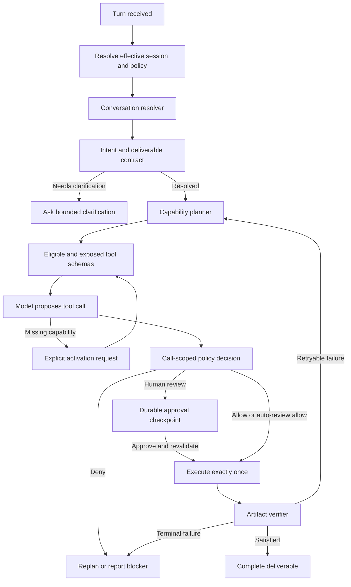

# Mochi Agent Tool Workflow P0-P2 Implementation Plan

## 文件狀態

- 狀態：Implementation in progress
- 建立日期：2026-07-23
- 最後更新：2026-07-26
- 範圍：普通 Chat 的對話理解、工具曝光、activation、policy、approval/resume、執行驗證與 UI 可觀測性
- 實作狀態：P0.1、P0.2、P1 enforce-only production cutover 已實作；P0.3 的 ordinary-Chat applied-result automatic reconciliation dispatcher 已完成。P2.2 full same-session ordinary-Chat model-history linearization 已通過獨立 acceptance matrix；P2.3 aggregate 的 Phase 0-4 implementation 與 final rollout gate 已完成，包含 storage identity、snapshot/range/named SSE、frontend strict cursor/repair、ToolCallCard aggregate projection、flag-on/flag-off rollback、migration rehearsal 與隔離 production build；sessions_dir 採 startup-only invariant，不做 live hot-switch。
- 優先順序：P0 安全與執行真實性 → P1 對話與能力規劃 → P2 驗證、持久化與可觀測性

## 0. Implementation Update (2026-07-24)

- P0.3: Ordinary Chat approvals persist an exact-call checkpoint and the
  original ReAct transcript can resume after the approved result is available.
  The result is durably recorded while the consume lease is held, before ReAct
  continuation, and the idempotency key includes the approved operation ID.
  Startup recovery never replays a mutation: it marks a successful applied
  result as `recovery_required` until a caller supplies current server policy
  to a future server-controlled reconciliation dispatcher. Reconciliation has
  a persistent single-owner lease: an active lease rejects a second caller;
  only stale lease or failed continuation becomes `unknown` and never
  auto-replays. This is at-most-one normal completion, not exactly-once across
  downstream continuation side effects. A bounded startup and scheduler
  dispatcher now continues only durably applied ordinary-Chat results through
  a strict server-owned session/policy gate; it never replays the mutation.
- P2.1: Required pending deliverables contribute their own target and
  acceptance criteria to `ArtifactVerifier`; unsupported criteria or missing
  targets fail closed. A verified `ArtifactReceipt` is persisted before task
  completion, and only matching required deliverables can become satisfied.
  File criteria retain the legacy `exists`/`non-empty`/`contains`/`sha256`
  reader. Versioned structured `tool_execution` criteria are matched only
  against already-observed tool events through a host-owned
  `ValidationProfileRegistry`: a profile-only criterion must bind exactly one
  same-turn call, while optional call/argument-digest/operation/turn pins are
  strict. The receipt records host-bound call/tool/digest/operation/turn
  evidence without persisting raw command or environment arguments. Unknown
  profiles, malformed/future criteria, ambiguous evidence, and ordinary text
  such as `tests pass` fail closed and never become shell commands. Approval
  continuations use the same verifier over the exact approved call. The model
  interpreter schema and shared `DeliverableContract` reader accept either a
  legacy string or an exact v1 file/tool-execution criterion; unknown kinds,
  extra fields, and future versions fail closed before durable state or the
  verifier. Default pytest/ruff profiles canonicalize only direct single
  commands and reject shell composition, redirection, substitutions, and
  PowerShell/cmd/bash wrappers.
  Scope enforcement covers complete structured `file_changes` and resolved
  target reports from first-party file mutation tools only; it cannot detect
  unreported side effects, and workspace snapshot-diff detection is not yet
  implemented. Receipts write schema v3; the reader migrates v1/v2 receipts
  without fabricating scope or execution evidence and rejects unknown future
  schemas. Automatic retry orchestration remains intentionally unimplemented.
- P2.2: Active-task and turn-checkpoint CAS now execute as one cross-process
  sidecar-lock protected read/check/append operation. Nonterminal checkpoints
  can be discovered for recovery without replaying side effects. Ordinary-Chat
  applied approval continuations are automatically dispatched through durable
  `pending|reconciling|continued|unknown` state and a single-owner lease.
  Same-session FIFO admissions now persist their own owner, token, and lease
  deadline before claim. A waiting live coordinator renews that admission
  lease; only its exact identity may claim. Reconciliation may terminally
  cancel a queued head only after that durable deadline expires with no active
  lane, recording `admission_owner_expired_before_claim`; this audit state is
  excluded from successor model history and never replays the orphaned user
  request. Legacy v1-v3 queued rows remain readable but have no recoverable
  admission proof and therefore require explicit cancellation rather than an
  age-based sweep.
  At the time of this 2026-07-24 update, checkpoint transitions deliberately
  did not hold a session lock across model generation or tool execution, and
  model input history had not yet been independently verified as linearized.
- P2.3: The API/UI projection labels the policy-bounded catalog explicitly as
  `policy_catalog` with `catalog_scope=policy_eligible`. Stream/replay remain
  per-event projections; no duplicate aggregate event was introduced.
- Verified at the time of this update: focused checkpoint/artifact/ReAct/approval
  regression suites and Python compilation. Full API/frontend regressions,
  isolated mypy, and full same-session model-history linearization were still
  pending on 2026-07-24; current status is recorded in section 0.2.

### 0.1 P2.3 aggregate 實作更新（2026-07-25）

本節是本計劃定稿後的實作進度補充，不改變後續 RFC 的 source-of-truth、
fail-closed、不可重播副作用或 rollout 語義。

- [x] Phase 0：strict v1 reader、legacy partial adapter、canonical JSON subset
  與 pure reducer 已完成；unknown／abandoned／cancel precedence，以及
  approval、timeline、receipt identity 均採 fail-closed 驗證。
- [x] Phase 1：Engine side-effect tool path 已接入 timeline 的 precommit、
  effect boundary 與 result persistence，並以 timeline 產生的 deterministic
  operation ID 取代隨機 observed operation ID。
- [x] Phase 2：`tool_observability_v1` 下的 durable outbox、approval
  observation/restart repair、reconciler、live publish gate，以及 delta 與
  startup server-only verifier/counters 已完成。reconciler 僅修復
  observation/outbox；不得重播已核准的 tool call。
- 主代理獨立驗收：aggregate/outbox/API 76 passed；approval 78 passed；
  workflow 72 passed；另已通過 `compileall` 與 `git diff --check`。
- [x] Phase 3/4：turn aggregate snapshot/range API、named SSE
  `tool_workflow_aggregate`、`Last-Event-ID`／per-turn cursor/gap repair，
  frontend strict parser/store 與 `ToolCallCard` aggregate projection 已完成。
  `sessions_dir` 採 startup-only reject + restart；不實作 live hot-switch。
- Final gate current status：flag-on/flag-off rollback、migration/storage-scope
  rehearsal、frontend type-check/lint 與隔離 production build 均通過；51 個
  frontend `test:*` scripts 已納入；48 個非 browser scripts 與 3 個
  dev-server browser fixtures 均已取得 clean exit。
  default `.next` 仍可能被外部 Next process 鎖定，故 build evidence 使用隔離
  dist output。
- [x] P2.2 的 full same-session ordinary-Chat model-history linearization
  已於後續獨立核實；closure 與 acceptance evidence 見 section 0.2。

### 0.2 P2.2 model-history linearization closure（2026-07-26）

- [x] `AgentEngine.chat()` 先 atomically admission user message 與 durable FIFO
  turn identity；只有取得同 session lane 的 turn 才能準備 model prompt。
- [x] prompt history 由 claim 後的同一 strict SessionStore snapshot 產生，
  predecessor turns 依 durable `sequence` 排序，turn 內 message 次序保持不變；
  JSONL 的實體 append 交錯不再決定模型看到的順序。
- [x] 相同 sessions root 上的兩個 `AgentEngine` instance 仍只會有一個 durable
  model lane；等待中的 coordinator 以 lease heartbeat 保持 ownership，而不是
  跨 model generation 或 tool execution 持 filesystem lock。
- [x] 從未執行的 cancelled/recovery-orphan turn 不進入 successor model history；
  completed、blocked、unknown predecessor transcript 保留。legacy history 保持
  prefix，既有 approval continuation compatibility messages 保持 deterministic
  tail，沒有重建 approval store 或 continuation state machine。
- [x] 三個 pre-admitted turns、cross-engine exclusion、queued cancellation、
  compatibility history、session CAS、approval/rehydration 與 API chat consumers
  均已重跑。證據與 working-tree hashes 見
  `docs/superpowers/handoffs/2026-07-26-p2-2-model-history-linearization-evidence.md`。

## 1. 目的

本計劃用來修復 Mochi Agent 工具工作流目前存在的端到端斷點。問題不是缺少 `file_write`、`file_edit` 或 `apply_patch`，而是下列局部機制尚未形成一致、可恢復且可驗證的狀態機：

- 對話上下文與省略指涉解析
- Intent 與 deliverable 描述
- Capability planning
- Tool catalog、schema exposure 與 activation
- Session policy 與 Auto Review
- 普通 Chat approval/resume
- Tool execution 與 artifact verification
- Durable turn state、併發隔離與 UI observability

本計劃不針對「做 B，通用版」或「你有哪些寫入工具？」加入固定句型。這些句子只作為回歸案例。目標是讓自然多輪對話、複合任務、旁支詢問、取消／覆蓋及否定限制都能形成正確的能力計畫。

## 2. 問題摘要

目前的主要斷點如下：

1. 主模型使用完整對話歷史，但 tool-intent classifier 只看最新訊息。
2. 互斥單標籤 intent 無法表達 read、write、exec、web 等複合任務。
3. Intent 誤判會同時移除 mutation schemas 並關閉 artifact obligation。
4. `tool_search` 只回傳 discovery metadata，沒有真正載入 schema 的 activation pathway。
5. 現行 activation 依賴模型先呼叫未曝光工具，在 native function calling 下通常不可達。
6. Mutation activation 又要求原 route 已是 `workspace_write`，形成契約死結。
7. UI 的 session Auto Review 沒有進入普通 Chat runtime；draft session materialize 還可能遺失 override。
8. `autonomy_mode` override 沒有展開完整 preset，畫面模式與 approval flags 可能相反。
9. File tools 把全域 approval/path policy 烘焙進 cached tool instance。
10. 普通 Chat 沒有 durable approval record、exact-call resume 與 restart-safe recovery。
11. Mutation success 主要依賴 tool result metadata，沒有獨立 artifact verifier。
12. 同 session 的 concurrent turns 可能共用並覆寫 activation policy state。

## 3. 核心設計原則

### 3.1 三層工具狀態

工具狀態必須拆成三層，禁止使用單一 `available` 或 `activation_required` 布林值涵蓋全部語意：

```text
Catalog
→ 系統安裝或可發現哪些工具

Eligible / Exposed
→ 本 session、workspace、run 與 model iteration 可取得哪些 schemas

Authorized Call
→ 這次具體 tool + arguments + target 是否允許執行
```

Activation 只能改變 eligible/exposed state；Approval 或 Auto Review 只能決定具體 call 是否可執行。兩者不得互相隱含。

### 3.2 多維 Intent Contract

Intent 不再是互斥單值，而是包含：

- Active goal
- Current speech act
- Resolved references
- Requested operations
- Deliverables 與 acceptance criteria
- Positive/negative constraints
- Mutation requirement：`required | forbidden | unknown`
- Clarification requirement
- Supersession/cancellation semantics

### 3.3 單一 Effective Policy 真相

Runtime 必須以 server-side effective policy snapshot 作為唯一安全真相。UI 只顯示該 snapshot，不自行推導或假設生效狀態。

### 3.4 具體呼叫後才審查

Auto Review 與人工 approval 都必須綁定：

- Tool name
- Normalized arguments
- Resolved target/scope
- Policy version
- Inventory version
- Request digest
- Operation ID

Approval 不得授權一個沒有具體參數的抽象「寫入能力」。

### 3.5 執行成功不等於任務完成

```text
review allowed
≠ tool executed
≠ artifact verified
≠ deliverable complete
```

每一層都必須有獨立狀態、receipt 與失敗處理。

### 3.6 Intent classifier 不是權威閘門

原先只讀取 latest message 的 `ToolIntentRouter` 已從 production 與程式碼庫退役。未來若建立任何 advisory classifier，它不得直接決定：

- mutation／exec schemas 是否曝光
- deliverable 或 artifact obligation 是否成立
- capability activation eligibility
- 具體 tool call 的安全授權、拒絕或 approval requirement

工具能力規劃的唯一語意來源是由 bounded conversation history、conversation summary 與 durable task state 解析出的 `TurnIntentContract`。目前 ordinary Chat production path 不再執行 latest-message classifier。未來若另建 classifier，只可離線用於 telemetry／evaluation，或在不影響能力與權限的獨立 routing 層使用，且必須附帶 confidence 與 evidence。

Classifier 的失敗、低信心、缺席或錯誤判斷，不得移除已由 `TurnIntentContract` 確認為完成 deliverable 所必要的能力；同樣地，classifier 也不得授予任何權限。最終安全邊界仍由 deterministic host policy、sandbox 與 call-scoped authorization 決定。

## 4. 目標流程



## 5. 目標資料契約

### 5.1 TurnIntentContract

```json
{
  "turn_id": "turn-...",
  "active_goal_id": "goal-...",
  "objective": "建立通用版專案",
  "current_speech_act": "request_execution",
  "resolved_references": [
    {
      "surface": "方案 B",
      "resolved_to": "在目前 workspace 建立專案檔案",
      "source_turn_ids": ["turn-previous"]
    }
  ],
  "operations": ["workspace_read", "workspace_write", "execution"],
  "deliverables": [
    {
      "kind": "workspace_artifact",
      "target_hint": "project directory",
      "required": true,
      "acceptance_criteria": []
    }
  ],
  "constraints": ["通用版", "不限影像模態"],
  "mutation_requirement": "required",
  "supersedes_previous_goal": false,
  "clarification_needed": false,
  "confidence": 0.94
}
```

### 5.2 EffectivePolicySnapshot

```json
{
  "policy_snapshot_id": "policy-...",
  "policy_version": "sha256:...",
  "source_chain": ["workspace_default", "session_override"],
  "autonomy_mode": "auto_review",
  "require_approval_for_file_write": false,
  "require_approval_for_exec": false,
  "file_read_scope": "workspace",
  "file_write_scope": "workspace",
  "hard_denies": [],
  "resolved_at": "..."
}
```

### 5.3 ToolInventorySnapshot

```json
{
  "inventory_version": "inventory-...",
  "catalog_tools": [],
  "eligible_tools": [],
  "exposed_tools": [],
  "activation_state": {},
  "policy_snapshot_id": "policy-..."
}
```

### 5.4 PendingToolCallCheckpoint

```json
{
  "run_id": "run-...",
  "turn_id": "turn-...",
  "tool_call_id": "call-...",
  "operation_id": "operation-...",
  "tool_name": "file_write",
  "normalized_arguments": {},
  "arguments_digest": "sha256:...",
  "policy_snapshot_id": "policy-...",
  "inventory_version": "inventory-...",
  "approval_status": "pending",
  "execution_status": "not_started",
  "resume_cursor": "..."
}
```

### 5.5 ArtifactReceipt

```json
{
  "operation_id": "operation-...",
  "resolved_targets": [],
  "changed_paths": [],
  "before_hashes": {},
  "after_hashes": {},
  "diff_summary": "...",
  "execution_status": "executed",
  "verification_status": "pending"
}
```

## 6. P0：安全與執行真實性

P0 必須先完成。P1 不得建立在不可信的 session policy 或不可恢復的 approval 上。

### P0.1 EffectivePolicyResolver

#### 工作項目

1. 建立單一 `EffectivePolicyResolver`。
2. 明確定義 precedence，例如：
   - Hard platform constraints
   - Workspace/project policy
   - Global defaults
   - Session override
   - Per-run temporary restrictions
3. `autonomy_mode` 必須展開完整 preset，不能只替換模式字串。
4. 區分可被 session 放寬的設定與只能收緊的硬限制。
5. 產生 deterministic `policy_snapshot_id`、version 與 source chain。
6. Context preview、non-stream chat、stream chat、agent invocation 使用相同 resolver。
7. UI 必須顯示後端回傳的 effective policy，而非只根據本地 store 推導。

#### 驗收條件

- Global strict + session auto-review 得到一致且文件化的完整 policy。
- Global permissive + session strict 會真正收緊 approval 與 scope。
- 相同輸入得到相同 policy version。
- UI 顯示值、run diagnostics 與 tool execution context 完全一致。
- Policy 無法突破 hard deny 或 sandbox scope。

### P0.2 普通 Chat policy 接線與工具實例去政策化

#### 工作項目

1. Draft session materialize 時原子保存 security override。
2. 普通 Chat 由 server 依經驗證的 durable session ID 解析 effective policy，不信任前端顯示狀態；ordinary Chat approval 的 `/resolve` 與 `/reconcile` 共用檔案存在、matching `session_meta.created` 與同一 event snapshot 驗證，缺失或損壞時 fail-closed。
3. Chat payload 可傳 policy snapshot expectation/version，用於偵測 stale UI；實際 policy 仍由 server 決定。
4. `chat/context`、`chat` 與 `chat/stream` 共用同一解析路徑。
5. FileWrite/Edit/Patch 與 exec tool 不再永久保存可變 session approval 設定。
6. Tool instance 只保留不可變能力與硬上限；每次 call 從 execution context 取得 effective policy。
7. Path scope、approval mode、Auto Review 及 hard deny 使用同一 snapshot。

#### 驗收條件

- 新建 session 在第一則訊息前選擇的模式不會遺失。
- 已存在 session 修改模式後，下一個 turn 使用新 snapshot。
- Cached registry/tool instance 不會使不同 session 的 policy 互相污染。
- Preview 與實際執行的 policy/version 一致，或明確回報 stale snapshot。
- Ordinary Chat approval 若缺少 session、session log 為空/損壞，或沒有 matching `session_meta.created`，在 consume、mutation 或 continuation 前以穩定 409 拒絕；nonordinary approval 不經此 session gate。

### P0.3 普通 Chat durable approval/resume

#### 工作項目

1. 將 `require_approval` 視為 durable interrupt，而不是普通 tool error。
2. 建立 approval record，保存具體 call、arguments digest、policy/inventory version 與 operation ID。
3. 暫停原 run 並發送可由 UI resolve 的 `approval_id`。
4. 核准後重新驗證：
   - Arguments digest
   - Workspace/sandbox scope
   - Current policy
   - Inventory/tool version
   - Stale-read/base digest
   - Ordinary Chat durable session ownership 與 matching creation event；policy 必須由該次驗證載入的同一 event snapshot 推導
5. 使用 operation ID 保證 exactly-once 或安全冪等重播。
6. Resume 原 ReAct turn，不要求模型重新組合 tool arguments。
7. Process restart 後能從 checkpoint 恢復。
8. Reject、expiry、policy drift 與 target drift 有明確 terminal/replan 狀態。

#### 驗收條件

- 普通 Chat 能產生 durable `approval_id`。
- Resolve 後執行原始 call，不產生第二個語意不同的 call。
- Restart 前後都能恢復且不重複寫入。
- Approval 後 arguments、policy 或 target 改變時，舊 approval 不可使用。
- `/resolve` 與 explicit `/reconcile` 對同一 ordinary Chat approval 使用相同 server-owned session policy gate；client 不能注入 current policy，也不能用損壞 checkpoint 降級成 nonordinary resolve。
- Auto Review 只取代人工 decision，不跳過 scope 與 hard-deny checks。

## 7. P1：對話、能力與 Activation

### P1.1 Conversation Resolver 與 Intent/Deliverable Contract

#### 工作項目

1. 建立兩層 state：
   - Active task state：目標、未完成產物、既有決策、執行進度。
   - Current turn state：本句 speech act、是否修改主任務、是否只是旁支問題。
2. Resolver 使用有限最近對話、conversation summary 與 durable pending deliverable。
3. 支援：
   - 代名詞與省略指涉
   - 選項／方案引用
   - 任務補充、取消、切換與覆蓋
   - 否定限制，例如「先不要修改」
   - 旁支詢問後返回主任務
4. Intent 由單標籤改為 operations 集合與 deliverable contract。
5. `mutation_requirement` 使用三態：`required | forbidden | unknown`。
6. 只有會實質改變結果的未知資訊才要求 clarification。
7. Resolver 輸出 evidence/source turn IDs，方便診斷與測試。
8. 退役 `ToolIntentRouter` 作為 tool exposure、artifact obligation 或 activation eligibility 的 authoritative gate。
9. Ordinary Chat production path 移除 latest-message classifier 呼叫；不得再維持第二條 advisory semantic pipeline。
10. Resolver 由 bounded recent history、conversation summary 與 durable task state 產生每個 turn 唯一的 `TurnIntentContract`。
11. Capability Planner、artifact obligation 與 diagnostics 必須共同消費同一份版本化 contract，禁止維持另一條由 latest-message label 驅動的平行語意管線。

#### 驗收條件

- 「做 B」在有前文時能解析，孤立出現時保持 unknown。
- 「把上一段存到 README」能形成 history reference + workspace write。
- 「比較方案但不要修改」會產生 mutation forbidden。
- 旁支詢問不會取消主任務，也不會擅自繼續主任務。
- 任務切換與取消能清楚更新 active goal。
- 不依賴固定中文句型或關鍵字特例。
- `tool_intent_router.py` 的 latest-message label 不再直接決定 mutation／exec schemas、artifact obligation 或 activation eligibility。
- Classifier 錯誤、低信心、不可用或關閉時，已解析且獲政策允許的 deliverable 仍能取得必要能力並完成。
- Classifier 不可授予、放寬或拒絕安全權限；具體呼叫仍由 host policy 與 call-scoped review 決定。
- 不存在「主模型依完整前文理解任務、工具閘門卻依最新一句另作決定」的雙語意管線。

### P1.2 Capability Planner 與 Tool Exposure

#### 工作項目

1. 將 operations/deliverables 映射為多能力計畫。
2. 使用下列交集建立 eligible tools：

```text
required capabilities
∩ session capabilities
∩ execution profile
∩ environment and sandbox constraints
∩ explicit allow/deny lists
```

3. 明確 workspace artifact request 在第一個 model iteration 直接曝光最小 mutation schemas。
4. Capability inquiry 只曝光 catalog/search 工具，不產生 mutation obligation。
5. 複合任務可同時曝光 read、write、exec、web 等最小必要集合。
6. Artifact obligation 從 deliverable contract 產生，不再由單一 route 推導。
7. 每個 model iteration 可依已完成步驟重建 exposure plan。

#### 驗收條件

- 「查資料、整理並寫報告」同時具備 web/read/write 能力。
- 「檢查後能修就修並跑測試」支援 conditional read/write/exec。
- 「有哪些寫入工具」不會 activation 或寫檔。
- Classifier 不再是 exposure 或 deliverable obligation 的 authoritative input；其失敗、低信心或缺席不得移除 `TurnIntentContract` 要求的能力。
- Exposure diagnostics 能說明每個工具為何被加入或排除。

### P1.3 真正的 Activation Contract

#### 工作項目

1. 將 `tool_search` 的兩種責任拆清楚：
   - 若只搜尋 catalog，命名與輸出不得宣稱已 activation。
   - 若支援 deferred loading，必須回傳實際 tool definitions。
2. 建立版本化、run-scoped activation state。
3. Activation 完成後，在下一個 model iteration 重建 callable schemas。
4. 不再依賴模型 hallucinate 未曝光的 tool call。
5. Mutation activation 依 capability plan 與 hard policy eligibility 判斷；具體 call 仍另走 approval/Auto Review。
6. MCP `tools/list_changed` 只刷新 catalog/inventory version，不自動曝光或授權新 mutation tools。
7. Activation denial 與 retry 使用明確原因碼與狀態轉移。

#### 驗收條件

- 真實 native function-calling backend 可完成 deferred tool loading。
- Search 結果出現後，下一輪 schema 中確實包含該工具。
- Activation 不等於 authorization。
- Catalog refresh 不會自動擴張 session 權限。
- 移除或停用現有 hidden-call bootstrap dead path。

## 8. P2：驗證、持久化、併發與 UI

### P2.1 Artifact Verifier 與受控重試

#### 工作項目

1. Mutation tools 回傳 structured `ArtifactReceipt`。
2. Verifier 重新讀取實際 target，不只信任 tool output metadata。
3. 驗證：
   - Target 存在性
   - Path/scope
   - Before/after digest
   - Expected content或patch結果
   - Diff 是否只含預期變更
   - 必要 lint/test
4. 多檔 patch 支援 partial commit、rollback/recovery plan 與 per-file receipt。
5. Retry policy 區分：
   - Retryable transient failure
   - Requires replan
   - Requires approval
   - Terminal failure
6. 使用 operation ID 防止 retry 重複副作用。
7. 只有 acceptance criteria 全部滿足才完成 deliverable。

#### 驗收條件

- Tool 自報成功但檔案不存在時，任務必須失敗。
- 內容或 digest 不符時不可宣稱已完成。
- Retry 不會重複追加或重複套用 patch。
- 多檔操作能指出成功、失敗及待恢復的個別 target。
- 最終回答與 verified artifact state 一致。

### P2.2 Durable Turn State 與併發隔離

實作狀態（2026-07-26）：cross-instance CAS、nonterminal discovery、ordinary-
Chat applied-result automatic reconciliation、lease-proven pre-claim FIFO
orphan recovery 與 full same-session ordinary-Chat model-history linearization
均已完成並通過獨立 acceptance matrix。實作以 durable FIFO lane、strict
snapshot 與 heartbeat 提供 linearization，不跨 model generation 或 tool
execution 持 filesystem/session lock。

#### 工作項目

每個 turn 至少持久化：

- Turn intent/deliverable contract
- Active goal linkage
- Policy snapshot/version
- Tool inventory/exposure snapshot
- Activation state
- Pending tool call
- Approval record
- Execution receipt
- Verification result
- Resume cursor
- Completion/blocker reason

另外：

1. Activation policy 與 artifact guard 改為 turn/run-scoped，不共用 session mutable dict。
2. 同 session concurrent turns 具有獨立 state 與 cancellation scope。
3. Session state 只保存跨 turn 需要的 active goal/open loops，不保存單輪可變執行細節。
4. Process restart 後能重建 waiting approval、precommitted、abandoned、executing/unknown 與 verifying 狀態；`abandoned` 表示已 durable precommit 但確知未跨越 effect boundary。
5. 對 precommitted/abandoned/executing/unknown 使用 receipt/idempotency reconciliation，不盲目重跑；只有 fresh operation identity 可重試已 abandoned 的呼叫。

#### 驗收條件

- 同 session 兩個 concurrent turns 不會覆寫彼此的 intent、allowlist 或 activation state。
- Restart 後 waiting approval 與 verification 可以繼續。
- 已完成 operation 不會因 replay 再執行。
- Session memory、active goal 與 turn execution checkpoint 邊界清楚。

### P2.3 UI Observability

Continuation update (2026-07-25): the Phase 3/4 aggregate delivery and final
rollout acceptance are complete for this scope. The browser consumes only
validated durable aggregate call state for workflow status, while raw transcript
events remain display-only. The current 51-script frontend matrix has clean exits
for all 48 non-browser scripts and all three dev-server browser fixtures. The
backend rollout gate, migration/storage-scope rehearsal, and isolated production
build all pass.

狀態：Phase 0 pure reducer、Phase 1 Engine mutation timeline integration、
Phase 2 durable outbox/reconciler/live gate/delta+startup verifier/counters、
Phase 3 snapshot/range/named SSE/frontend cursor repair 與 Phase 4 aggregate
ToolCallCard projection 已完成；既有 API/UI projection 仍保留為
non-authoritative transcript compatibility fallback。sessions_dir 採
startup-only invariant，不做 live hot-switch。P2.3 的 flag-on/flag-off rollback
rehearsal、migration/storage-scope rehearsal 與隔離 frontend production build
均已驗收；default `.next` 的鎖檔只屬本機環境限制。定稿規格見
`documents/architecture/2026-07-25-tool-workflow-aggregate-stream-replay-rfc.md`。

#### 工作項目

UI 分別呈現：

1. Effective policy
   - Mode
   - Source
   - Version
   - 是否與 UI expectation 一致
2. Tool inventory
   - Catalog
   - Eligible
   - Exposed this iteration
   - Activation status/reason
3. Concrete call review
   - Tool/arguments/target
   - Auto Review decision 或 approval status
4. Execution/verification
   - Operation ID
   - Changed paths
   - Verification status
   - Retry/replan/blocker
5. Aggregate stream/replay
   - 僅由 durable timeline、turn checkpoint、approval 與 receipt 重建。
   - 所有 aggregate update 具 version、event ID、per-turn seq 與
     idempotency key；idempotency input 只含 authoritative source position/
     canonical digest 與 normalized state，不得由 outbox/delivery 自我觸發。
     event ID 必須是固定格式 opaque hash，不洩漏 session/turn ID；approval
     lifecycle 必須使用 atomically incremented monotonic `approval_revision`，
     不得以 `updated_at` 代替。stream/reload 使用相同 reducer。
   - `unknown`、`cancelled`、approval lifecycle 與 absent evidence 必須獨立
     呈現，不得由無 error 的 tool result 推論成功。
   - `not_started`（未 precommit）、`precommitted`（未跨 boundary）、
     `abandoned`（已 precommit 且確知無 effect）與 `unknown`（已開始或可能
     已開始但結果不明）必須分別呈現；`cancelled` 不得覆蓋 `abandoned` 或
     `unknown`。

先決條件：Engine 的 side-effecting tool execution 必須接入
`TimelineCoordinator.before_mutation()` 與 `persist_tool_result()`，並使用
timeline 產生的 deterministic operation ID。此接線完成前不得將 aggregate
event 視為 production authority。

UI 文案不得再把 Auto Review 描述為「啟用工具」。Agent 也不得建議使用者操作不存在的 activation 控制。

#### 驗收條件

- 使用者能看出「工具不存在、未 eligible、未 exposed、待 activation、待 approval」的差異。
- Auto Review 顯示的是 runtime effective snapshot，不只是 local selection。
- Approval UI 顯示具體 call 與變更預覽。
- 最終產物驗證狀態可追蹤。
- 相同 durable sources 的 non-stream response、SSE replay 與 session reload
  產生相同 aggregate；duplicate/gap/future schema 皆 fail closed。

## 9. 跨階段測試矩陣

| 類別 | 測試案例 | 預期結果 | 階段 |
|---|---|---|---|
| Session policy | Draft session 選 Auto Review 後送第一則訊息 | Runtime 使用相同 effective snapshot | P0 |
| Policy matrix | Global strict + session auto-review | 完整且一致的 preset 行為 | P0 |
| Policy matrix | Global permissive + session strict | Approval 與 scope 真正收緊 | P0 |
| Approval | 普通 Chat file write 需要人工核准 | 產生 approval ID 並暫停原 call | P0 |
| Resume | Process restart 後核准 | 精確恢復且只執行一次 | P0 |
| Policy drift | Approval 等待期間 policy 改變 | 舊 approval 失效或重新審查 | P0 |
| Reference resolution | 有前文時「做 B，通用版」 | 正確解析 deliverable 與 operations | P1 |
| Genuine ambiguity | 新 session 單獨輸入「做 B」 | Unknown/clarification，不擅自寫入 | P1 |
| Side question | 執行中詢問有哪些寫入工具 | 只回答問題，主任務保持 pending | P1 |
| Negative constraint | 「先分析，不要修改」 | Mutation forbidden | P1 |
| Composite task | 查資料、整理、寫報告、跑檢查 | 同時規劃 web/read/write/exec | P1 |
| Tool discovery | 「有哪些寫入工具」 | Catalog only，不 activation、不 mutation | P1 |
| Native activation | Deferred tool search 命中工具 | 下一輪 callable schema 出現 | P1 |
| Catalog update | MCP list changed | 只刷新 inventory，不自動授權 | P1 |
| Artifact verification | Tool 回 success 但檔案不存在 | Verification failed | P2 |
| Idempotency | Resume/retry append 或 patch | 不重複副作用 | P2 |
| Timeline boundary | Durable precommit 後 effect boundary 前明確失敗 | 顯示 `abandoned` known no-effect，保留 operation identity，replay 不重跑 | P2 |
| Timeline boundary | Effect boundary 後遺失結果 | 顯示 sticky `unknown`，不可降為 `abandoned` 或 `not_started` | P2 |
| Partial failure | 多檔 patch 中一檔失敗 | 精確 partial state 與 recovery plan | P2 |
| Concurrency | 同 session 並行兩個不同 intent | State 完全隔離 | P2 |
| Language coverage | 中文、英文、混合語言及口語 | 語意等價，不依賴固定句型 | P1/P2 |
| Long context | Compaction/restart 後引用 pending deliverable | Durable state 可解析 | P1/P2 |
| Classifier removal | Ordinary Chat invoke／preview | 不呼叫 latest-message classifier；只由 contract 產生 capability plan | P1 |
| Contract write | Contract 要求 workspace artifact | 曝光必要 write capability，且 required mutation 無法被模型標成 satisfied | P1 |
| Contract prohibition | Contract 為 mutation forbidden | 不曝光或 activation write；baseline ranking 不可授權 | P1 |

## 10. 遷移策略

### 10.1 Enforce-only cutover

1. `TurnIntentContract` 與 `CapabilityPlan` 是普通 Chat 唯一的 production 語意與能力來源，不保留 legacy／shadow 行為切換。
2. 舊設定中的 `turn_contract_mode: legacy | shadow` 在讀取時單向遷移成 `enforce`；API 與前端不再接受或輸出回退值。
3. Resolver、planner 或 adapter 失敗時 fail closed，不再以 latest-message classifier 結果繼續生成或曝光工具。
4. 舊 keyword/routed-intent exposure planner 已刪除；production baseline 不接受 message、intent 或 route，只計算 backend/tool-mode/autonomy hard ceilings、schema budget 與明確的 broker policy tools。
5. 若需要比較舊 classifier，只可離線 replay 已去識別化的 contract diagnostics，不得在 production request path 執行。

### 10.2 後續 component flags

後續 flags 只可隔離尚未完成且彼此獨立的子系統，不得切換回舊語意來源：

- `chat_durable_approval_v1`
- `artifact_verifier_v1`
- `turn_state_isolation_v1`
- `tool_observability_v1`

### 10.3 Rollout gates

每一階段進入預設啟用前必須滿足：

- Targeted unit/integration tests 全部通過。
- 新舊差異有分類與可接受門檻。
- Approval、policy、activation 與 artifact 事件可在 diagnostics/UI 追蹤。
- Component flag rollback 不得改變 contract/capability plan 的權威地位，且不破壞既有 session store。
- Persisted schema 有版本與 migration/fallback reader。

## 11. 實作依賴與順序

```text
P0.1 EffectivePolicyResolver
→ P0.2 Chat policy wiring and dynamic tool policy
→ P0.3 Durable approval/resume
→ P1.1 Conversation Resolver
→ P1.2 Capability Planner and exposure
→ P1.3 Activation v2
→ P2.1 Artifact Verifier
→ P2.2 Durable state and concurrency isolation
→ P2.2 Engine mutation timeline integration
→ P2.3 Phase 0 pure reducer
→ P2.3 Phase 2 durable outbox/reconciler/verifier
→ P2.3 Phase 3 SSE/API/UI observability
```

P0.1、P0.2 可以在同一實作批次設計，但驗收需分開。P1.1 可與 P0 後半並行研究，但不能在 policy snapshot 未穩定前切換 production exposure。P2 的 receipt/idempotency schema 應在 P0.3 設計 approval checkpoint 時預留欄位。

## 12. 主要程式熱點

預期涉及但不限於：

- `mochi/agents/engine.py`
- `mochi/agents/tool_exposure.py`
- `mochi/agents/react_loop.py`
- `mochi/tools/registry.py`
- `mochi/tools/registry_factory.py`
- `mochi/tools/tool_search.py`
- `mochi/tools/file_ops.py`
- `mochi/security/policy.py`
- `mochi/api/routes/chat.py`
- `mochi/api/routes/sessions.py`
- `mochi/api/routes/approvals.py`
- `mochi/runtime/service.py`
- `web/src/lib/api.ts`
- `web/src/lib/stores/session-store.ts`
- `web/src/app/page.tsx`
- Chat/approval/task panel UI components

## 13. 參考架構結論

本計劃採用下列共同設計，而非逐案複製參考專案：

- OpenClaw：分層 tool policy pipeline 與每 run 重算 exposure。
- ZeroClaw：eligible、activated state、ApprovalManager 分離。
- Hermes：具體 command 執行時動態讀取 approval policy。
- cc-haha：deferred tool schema、call-level permission 與 runtime UI state 分離。
- OpenAI/Anthropic：tool search 必須載入真實 definitions，discovery 不等於 authorization。
- MCP：`tools/list` / `list_changed` 是 catalog synchronization，不是 activation 或 approval。
- LangGraph：approval interrupt、checkpoint、resume 與副作用冪等性。

## 14. 非目標

以下不屬於本計劃的直接目標：

- 以關鍵字特例修補單一對話句型。
- 將全部 history 直接塞入既有 latest-message classifier，或只增加更多 intent 關鍵字，並把它繼續保留為權威閘門。
- 因 Auto Review 而曝光所有 mutation/exec tools。
- 讓模型自行決定或覆寫 hard security policy。
- 把 tool discovery、activation、approval 合併成單一布林狀態。
- 僅靠 prompt 宣告安全規則。
- 在 artifact 未驗證前宣稱任務完成。
- 無限制將全部 conversation history 傳入 classifier 或 resolver；應使用 bounded history、summary 與 durable task state。

## 15. 完成定義

本計劃完成時，普通 Chat 必須符合：

1. 使用者的自然多輪要求能形成可追蹤的 goal、operations 與 deliverables。
2. 明確需要的工具 schema 能在合理的 model iteration 中出現。
3. Catalog、exposure、activation 與 authorization 狀態彼此獨立。
4. UI 選擇的 session policy 與 runtime effective policy 一致且可驗證。
5. Auto Review 僅審查具體 call，不擴張 capability 或 sandbox。
6. 人工 approval 能暫停、持久化、跨 process 恢復且不重複副作用。
7. Tool execution 後由 verifier 確認 artifact 與 acceptance criteria。
8. 同 session concurrent turns 不會互相污染執行狀態。
9. UI 能準確說明目前卡在理解、曝光、activation、approval、執行或驗證的哪一層。
10. 上述行為有端到端測試，不只依賴 fake backend 的局部 unit contract。

## 16. 進度追蹤

### 16.1 已完成的實作切片（2026-07-24 至 2026-07-25）

- [x] `EffectivePolicyResolver`、immutable snapshot、deterministic version/source chain 與 preset 完整展開。
- [x] Draft session create/materialize 原子保存 `security_override`；materialize 後 UI 只接受 server create/detail 的 persisted state。
- [x] Ordinary Chat non-stream/stream 由 server 每 turn 重讀 session override，傳遞完整 effective policy snapshot。
- [x] FileWrite/FileEdit/ApplyPatch 改為每次 call 消費 execution-context policy，不受 cached global approval/path 設定鎖死。
- [x] 版本化 `TurnIntentContract`、bounded `ConversationResolver` 與模型驅動 interpreter；ordinary Chat production path 已移除 latest-message classifier 呼叫。
- [x] 刪除 `tool_intent_router.py`、keyword/routed-intent exposure planner 與其舊測試；production policy baseline 不再接受 message 或 intent。
- [x] Contract-only `CapabilityPlanner`、artifact obligation、multi-capability exposure plan 與 include/exclude diagnostics。
- [x] 同 capability 工具以固定 catalog metadata priority 選擇；未顯式選取 skill 時，latest-message skill matching 不再改變 capability exposure priority。
- [x] `ActiveTaskState`／contract 嚴格 round-trip 與 fail-closed `ConversationStateRepository`。
- [x] Activation 與 authorization 解耦；contract-derived mutation eligibility 是唯一權威，缺 contract/capability policy 時 fail closed。
- [x] Callable `tool_activate` broker、`tool_search → activation → schema refresh → concrete call` native-like E2E。
- [x] `AgentEngine` 採 enforce-only；每 turn 建立唯一 contract，capability plan 是 exposure 與 activation 的權威來源，resolver/planner 失敗時 fail closed。
- [x] Engine 在 resolve 前載入 durable active task，resolve 後保存 next state；成功 mutation event 加 final answer 可完成 task，旁支問題不重開已完成 deliverable。
- [x] Prompt hard-overflow 在 semantic model call 前攔截，並以實際 scoped registry（含 activation broker）計算 schema budget；invocation-owned backend 在 early return 關閉。
- [x] 本輪新增 current-turn required deliverable invariant：模型不得以 `satisfied` 取消本輪寫入 obligation；歷史已完成 deliverable 保持完成。
- [x] Enforce-only 最終驗證：contract/capability/exposure/activation 140 tests、engine 46 tests、config/session 105 tests、frontend type-check、compileall、diff check 與 8 個 cutover 模組的 isolated mypy。
- [x] Metamorphic regression：相同 resolved contract 與 hard ceilings 下，不同 latest-message 措辭產生完全相同 exposed 與 activation-eligible tool plan。
- [x] P0.2 exec/ExecuteCode 路徑改為每次 call 消費 effective policy；cached tool 跨 policy snapshot 的 allow、approval 與 hard-deny 無副作用測試已驗證。Windows helper 的 CRLF 差異已確認為既有 fixture 行為。
- [x] P0.3 explicit and automatic reconciliation: ordinary Chat approval stores exact arguments, operation ID, policy/inventory/workspace identity and resume cursor; successful execution evidence is durable before ReAct continuation. The API and bounded startup/scheduler dispatcher derive policy from the strict persisted session server-side, use a durable single-owner continuation lease, and never replay the mutation.
- [x] P2.1 `ArtifactVerifier` is integrated into both normal and approval-continuation task completion. Required pending deliverable targets and acceptance criteria are authoritative; a receipt persists before CAS completion. Structured scope enforcement is limited to complete `file_changes` and resolved-target reports from first-party file mutation tools; it does not detect unreported side effects and no workspace snapshot diff exists. Receipts write schema v3, readers migrate v1/v2 without inventing scope or execution evidence, and reject unknown future schemas. `tool_execution` acceptance uses a host-owned validation profile matcher over a same-turn normal/approved tool event; evidence records exact call/tool/canonical argument digest/operation/turn/exit status, but never treats natural-language criteria as commands. Initial `pytest` and `ruff` profiles are only defaults; deployments may inject project profiles. Automatic retry is still not implemented.
- [x] P2.3 API/UI projection 使用 policy-bounded `policy_catalog`、eligible/exposed/activation/review/execution/verification 狀態；type-check 與 lint 已通過。stream/replay 仍採既有 per-event projection。
- [x] P2.3 Phase 0：`tool_workflow_aggregate` pure reducer、strict reader、legacy partial adapter 與 canonical JSON subset；未知／中止／取消 precedence 及 approval、timeline、receipt identity 均 fail closed。
- [x] P2.3 Phase 1：Engine mutation timeline integration 已完成，side-effecting call 使用 timeline-generated deterministic operation ID，並持久化 precommit/effect boundary/result。
- [x] P2.3 Phase 2：`tool_observability_v1` durable outbox、approval observation/restart repair、idempotent reconciler、live publish gate、delta/startup server-only verifier 與 source mismatch/duplicate/gap/unsupported counters 已完成；repair 不會執行或重播 tool。
- [x] P2.3 主代理獨立驗收：aggregate/outbox/API 76 passed、approval 78 passed、workflow 72 passed，並通過 `compileall` 與 `git diff --check`。
- [x] P2.3 Phase 3/4：snapshot/range API、named SSE、cursor/gap repair、frontend strict parser/store 與 `ToolCallCard` aggregate projection 已完成；storage-root consistency 由 startup-only `sessions_dir` binding 與 `storage_id` scope 保證。
- [x] P2.3 final gate clean-exit closure：51 個 frontend `test:*` scripts 均有 clean exit；rollout/config/settings current targeted matrix 158 passed、migration/storage-scope current matrix 48 passed；frontend type-check/lint 與隔離 production build 通過。

### 16.2 Production cutover 實作狀態

- [x] 由 `AgentEngine` 每 turn 建立唯一 `TurnIntentContract`，不提供 legacy／shadow runtime bypass。
- [x] Engine resolve 前載入 durable active task，resolve 後保存 next state。
- [x] Existing exposure、artifact obligation、activation policy 共用同一份 `CapabilityPlan`；invoke 與 preview 均不再執行舊 classifier。
- [x] 將 `mutation_requirement`、`requested_operations`、`required_capabilities` 傳入 activation policy；registry 已移除 routed-intent fallback 與 shadow default。
- [ ] Production `preview_chat_context` 消費 effective policy snapshot；補 reused session/cached context E2E。
- [ ] Exec/ExecuteCode 類工具去除 cached mutable policy；接入通用 hard-deny enforcement。
- [x] 完成 full turn concurrency isolation 與 UI observability：ordinary Chat applied-result automatic dispatch、production explicit dispatch、lease reconciliation primitive、artifact verification、cross-instance CAS 與 P2.2 full same-session ordinary-Chat model-history linearization 均已完成；P2.3 aggregate SSE/UI implementation 與 final rollout gate 已完成。

### P0

- [x] P0.1 EffectivePolicyResolver
- [x] P0.2 普通 Chat policy 接線與工具實例去政策化
- [x] P0.3 production explicit and automatic applied-result reconciliation dispatcher.

### P1

- [x] P1.1 Conversation Resolver 與 Intent/Deliverable Contract
- [x] P1.2 Capability Planner 與 Tool Exposure
- [x] P1.3 Activation v2

### P2

- [x] P2.1 Artifact Verifier receipt persistence, contract-bound deliverable completion, and structured validation-evidence binding
- [x] P2.2 Durable Turn State：cross-instance CAS、nonterminal discovery、ordinary-Chat applied-result automatic reconciliation、lease-proven pre-claim FIFO orphan recovery 與 full same-session ordinary-Chat model-history linearization 已完成。
- [x] P2.3 UI Observability implementation：Phase 0-4 aggregate reducer、timeline integration、durable outbox/reconciler/live gate、snapshot/range/SSE、frontend repair store、UI projection 與 final rollout/rollback gate 已完成。

### Cross-cutting

- [x] 測試矩陣（workflow/backend focused matrix 與 51/51 frontend scripts 均通過）
- [x] Enforce-only cutover 與舊設定單向 migration
- [ ] Persisted schema migration
- [x] Rollback rehearsal（flag-on、flag-off、publication rollback 與 startup-only reject evidence 已通過）

### 16.3 已知剩餘風險與 rollout 限制

1. History evidence ID 是帶位置的內容 hash，不是持久化 event/turn primary key。
2. Task completion 已使用獨立 `ArtifactVerifier` 重新讀取 target，驗證 existence、內容/digest 與 supported acceptance criteria 後才持久化 receipt。P2.1 scope enforcement 僅驗證 first-party file mutation tool 完整 structured `file_changes` 與 resolved target report，未回報 side effect 無法偵測，workspace snapshot diff 尚未實作。Lint/test acceptance 只接受 host-owned validation profile 對同 turn normal/approved tool evidence 的結構匹配；內建 `pytest`/`ruff` 僅為初始 profiles，未知 profile fail closed。完整 retry orchestration 仍未實作。
3. Ordinary-Chat prompt context 在 durable FIFO claim 後由同一 strict snapshot 準備；同 session concurrent turns 的 model input 已按 durable turn sequence 線性化。Lease-proven pre-claim orphan turns are excluded from successor model history, but v1-v3 queued timeline rows lack admission ownership/deadline evidence and cannot be auto-recovered.
4. 極小 schema budget 下會優先保留必要直接工具與 `tool_activate` broker，可能淘汰 `tool_search` schema；後續應讓 broker 提供受 hard ceilings 約束的 catalog/query，而不是依賴模型已知精確工具名。
5. P2.3 aggregate stream/replay 的 production source join、outbox/reconciler、approval observation repair、snapshot/range API、named SSE、gap repair、前端 projection、flag rollback 與 migration/storage-scope rehearsal 均已實作並驗收；default `.next` 的鎖檔只屬本機環境限制，隔離 production build 已通過。
6. `sessions_dir` 以 startup-only reject + restart 完成 storage-root consistency；`storage_id` scope 防止瀏覽器 cursor 跨 root 重用。不支援 live hot-switch。
7. P2.2 closure 不代表跨 model/tool execution 持有 filesystem lock；排他性由 durable lane lease/heartbeat 提供。ordinary-Chat approval continuation 仍消費其 exact ReAct checkpoint，並以 compatibility transcript 進入後續 fresh Chat history，不被當成新的可重播工具呼叫。
